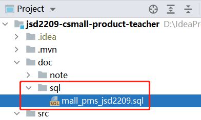

# 1. 关于`csmall-product`项目

这是“酷鲨商城”大项目中的“商品管理”项目，是一个后台管理项目（给管理员，或运营人员使用的项目，并不是普通用户使用的），并且，只会涉及与发布商品可能相关的功能开发，整个系统中需要的其它功能将由其它项目来实现！另外，此项目只是一个后端项目，采取了前后端分离的开发模式。

在本阶段，还会开发`csmall-passport`项目，这是“管理员管理”的后端项目，还有`csmall-web-client`项目，这是“前端项目”。

# 2. 创建`csmall-product`项目

在IntelliJ IDEA的创建项目向导界面中，左侧选择`Spring Initializr`，右侧参数选择：

- **Server URL：**使用 `https://start.spring.io` 或 `https://start.springboot.io` ，在这2个中选择任何一个可用的，如果暂时出现这2个均不可用，可以反复尝试，或稍后尝试
- **Name：**使用`csmall-product`即可，老师使用的是`jsd2209-csmall-product-teacher`
- **Group：**`cn.tedu`
- **Artifact：**`csmall-product`
- **Package Name：**`cn.tedu.csmall.product`
- **Java：**`8`

在勾选依赖的界面，可以**不勾选**任何依赖，直接将项目创建出来！

老师的GITEE仓库地址如下：

-

  

# 3. 调整`pom.xml`

关于当前项目的父级项目的版本，推荐使用`2.5.x`系列的版本号，其中，`x`可以是`0`到`14`之间的任何数字。


完成后，在`src/test/java`下找到默认已经存在的包，包下有测试类，测试类中有个空的测试方法：

```java
@Test
void contextLoads() {
}
```

执行此测试方法，应该是可以通过测试的！如果无法通过测试，应该是项目的依赖项或某些配置的错误导致的，需要及时调整。

# 4. 创建数据库

创建名为`mall_pms`的数据库：

```mysql
CREATE DATABASE mall_pms;
```

提示：SQL语句并不区分大小写。


# 5. 配置Database面板

在IntelliJ IDEA的窗口右侧，可以展开`Database`面板，可以辅助处理数据库、数据表的相关操作，通常，在开发一个项目之前，强烈推荐配置此面板！

提示：如果在窗口右侧没有`Database`面板，可以点击`View`菜单 > `Tool Windows`子菜单，找到`Database`菜单项，点击它，即可展开右侧的`Database`面板。


**注意：**如果出现`[42000][-1] (conn=214) invalid fetch size`错误，应该删除当前配置，重新添加配置，并且，在`MariaDB`和`MySQL`之间切换选择。

详细配置教程：http://doc.canglaoshi.org/doc/idea_database/index.html

# 6. 导入数据表

将老师提供的SQL复制到Database面板的console中，全部执行，即可创建当前库中的所有表，并插入了一些测试用的数据。



# 7. 功能的开发顺序

首先，要明确当前项目中涉及哪些数据：

- `pms_album`：相册
  - 与“图片”是类似“文件夹”与“文件”的关系
- `pms_attribute`：属性
- `pms_attribute_template`：属性模板
  - 与“属性”是类似“文件夹”与“文件”的关系
- `pms_brand`：品牌
- `pms_brand_category`：品牌与类别的关联
- `pms_category`：类别
- `pms_category_attribute_template`：类别与属性模板的关联
- `pms_picture`：图片
- `pms_sku`：SKU
- `pms_sku_specification`：SKU属性
- `pms_spu`：SPU
- `pms_spu_detail`：SPU详情

通常，应该**先开发偏基础的数据**，例如，品牌、类别等都是SPU的基础，所以，应该先开发品牌、类别这类数据的管理功能，再开发SPU、SKU这类数据的管理员。

对于多种并不直接相关的数据，应该**先开发逻辑简单的数据**，相对来说，类别可能更多“麻烦”一些，因为“类别”是一种“多层级”的数据，例如“家用电器”是“电视”的父级，其下还有“冰箱”、“空调”，而这些子级类别还可以有更子级的类别，例如“空调”就可以有“挂机空调”、“柜机空调”、“中央空调”等子级，所以，类别比品牌、相册这些数据的逻辑规则会更复杂一些，应该先开发品牌、相册等数据的管理功能。

对于各数据的功能开发，**大致上应该采取增 > 查 > 删 > 改的开发顺序**。

每一个功能的开发，**大致上应该采取Mapper > Service > Controller > 页面的开发顺序。**

# 8. 添加Mybatis相关依赖项

在`pom.xml`中添加依赖项：

```xml
<!-- Mybatis整合Spring Boot的依赖项 -->
<dependency>
    <groupId>org.mybatis.spring.boot</groupId>
    <artifactId>mybatis-spring-boot-starter</artifactId>
    <version>2.2.2</version>
</dependency>
<!-- MySQL的依赖项 -->
<dependency>
    <groupId>mysql</groupId>
    <artifactId>mysql-connector-java</artifactId>
    <scope>runtime</scope>
</dependency>
```

由于Spring Boot存在自动配置，当添加了数据库编程相关的依赖项后，无论是启动项目，还是执行任何Spring Boot测试，都会尝试**读取**连接数据库的配置信息，如果还没有添加相关配置，会导致启动失败/测试失败，例如：


为了解决此问题，需要在配置文件中，添加连接数据库的相关配置。

# 9. 关于Spring Boot的配置文件

## 9.1. 关于`application.properties`

在Spring Boot项目中，在`src/main/resources`文件夹下存在`application.properties`文件，此文件是Spring Boot会自动读取的配置文件。

Spring Boot定义了许多特定用途的配置，在`application.properties`中，需要按照特定的属性名进行配置，则Spring Boot读取到了这些特定的配置后，会自动应用起来！

例如，添加连接数据库的配置：

```properties
spring.datasource.url=jdbc:mysql://localhost:3306/mall_pms?characterEncoding=utf-8&useUnicode=true&serverTimezone=Asia/Shanghai
spring.datasource.username=root
spring.datasource.password=root
```

## 9.2. 关于Profile配置

以上在`application.properties`中添加的是连接数据库的配置信息，当前处于开发阶段，所以，各配置值都是开发时所使用的MySQL的相关配置，例如`localhost`、`3306`、用户名、密码等，当开发完成后，可能会有专门的测试人员对此项目进行测试，测试时使用的MySQL肯定不会是当前开发使用的MySQL，则以上属性的值都需要修改，当测试通过后，项目正式上线，使用的MySQL又会不同，则各属性值需要再次修改……即使全部改完了，项目可能需要进入下一阶段的开发，以上各属性值又需要改回成开发时的配置值！在开发实践中，除了连接数据库的配置信息以外，其它配置也可能会根据项目的运行环境不同，而使用不同的配置值！

Spring框架提供了Profile配置的机制，允许同时存在好几套配置文件，这些配置文件默认是可以不激活的（默认是无效的），当需要使用哪套配置，就激活哪套配置文件即可，这样的配置文件称之为Profile配置。

Spring Boot框架很好的支持了Profile配置，其规则是：

- `application.properties`是主配置文件，其中的所有配置都是默认加载的
- 以`application-自定义名称.properties`作为文件名的全部是Profile配置，默认是不加载的，必须激活这些文件中的配置才会被加载
- 在`application.properties`（主配置文件）中，使用`spring.profiles.active`属性，可以激活Profile配置，此属性的值就是Profile配置的文件名的自定义部分，如果有多个Profile配置需要激活，使用逗号分隔即可
- 如果在`application.properties`（主配置文件）中，与在Profile配置中，存在完全相同的属性的配置，则以Profile配置为准

例如：


以上图为例，可以在`application.properties`中配置`spring.profiles.active`属性，当取值为`dev`时，`application-dev.properties`文件中的配置信息将被应用，当取值为`test`时，`application-test.properties`文件中的配置信息将被应用，以此类推。

在开发实践中，类似的配置文件可能较多，可以完全自行测试，例如，可以创建`application-dev-jack.properties`、`application-dev-tom.properties`，就可以区分不同的开发人员，当然，激活时，取值仍是自定义名称的部分，例如：`spring.profiles.active=dev-jack`。

## 9.3. 关于YAML配置

YAML是一种编写配置文件的语法，表现为以`.yml`作为扩展名的文件。

相比`.properties`文件，其语法的改变有：

- 原属性名中有小数点的部分，改为使用冒号+换行后空2格
- 原属性名与属性值使用等于号分隔，改为使用冒号+1个空格
- 如果多个配置中，属性名有相同的部分，则不必配置相同的部分，保持对应的空格（缩进）即可

例如，原有的关于数据库连接的配置，使用YAML语法则改为：

```yaml
spring:
  datasource:
    url: jdbc:mysql://localhost:3306/mall_pms?characterEncoding=utf-8&useUnicode=true&serverTimezone=Asia/Shanghai
    username: root
    password: root
```

**注意：**YAML语法要求是严格的，必须按照以上语法规则，例如每次换行后需要添加2个空格，不可以使用TAB制表位取代，属性名与属性值之间，冒号的右侧必须有1个空格。

**注意：**不允许存在完全相同的多行配置（包括缩进），例如不可以同时存在2行`spring:`。

**提示：**在使用IntelliJ IDEA编辑`.yml`文件时，会自动将按下的TAB转换为2个空格。

**提示：**对于纯数字的属性值，如果此属性的值应该是字符串时，需要使用引号框住整个数字。

**提示：**在Spring Boot项目中，即使没有将属性名中的小数点换成YAML语法应该有的样子，也不会出错！

在Spring框架中，并不直接识别YAML语法的配置，在Spring Boot项目中，基础依赖项（`spring-boot-starter`）中已经包含解析YAML配置的工具包（`snakeyaml`），可以直接识别并解析YAML语法的配置文件。

在Spring Boot项目中，对`.yml`文件的支持，与对`.properties`文件的是完全相同的，即：你可以将所有`.properties`文件改成`.yml`文件，再调整配置文件内部的语法即可。


# 10. 检测连接数据库的配置是否正确

在项目中原本已经存在的测试类`CsmallProductApplicationTests`类中，添加以下代码，并执行测试：

```java
@Autowired
DataSource dataSource; // 注意：导java.sql包中的接口

@Test
void getConnection() throws Throwable {
    dataSource.getConnection(); // 调用getConnection()时会连接数据库，则可以判断配置的连接信息是否正确
}
```

当配置的`spring.datasource.url`的值的格式有误时，会出现错误：

```
Caused by: java.lang.IllegalArgumentException: URL must start with 'jdbc'
```

当配置的`spring.datasource.url`中的主机名部分有误时，会出现错误：

```java
Caused by: java.net.UnknownHostException: localhast
```

当配置的`spring.datasource.url`中的端口号部分有误时，会出现错误：

```java
Caused by: java.net.ConnectException: Connection refused: connect
```

当配置的`spring.datasource.url`中的`serverTimezone`参数值有误时，会出现错误：

```
Caused by: java.time.zone.ZoneRulesException: Unknown time-zone ID: Asia/ShangHai
```

当配置的`spring.datasource.username`的值有误时，会出现错误：

```
java.sql.SQLException: Access denied for user 'root123'@'localhost' (using password: YES)
```

当配置的`spring.datasource.password`的值有误时，会出现错误：

```
java.sql.SQLException: Access denied for user 'root'@'localhost' (using password: YES)
```

```
java.sql.SQLException: Access denied for user 'root'@'localhost' (using password: NO)
```

**注意：**关于连接数据库的配置，各属性名是预定义的，如果属性名写错，相当于是没有配置此属性！

**注意：**配置的值，不要有多余的空格，这些空格也会被当作值的一部分！

# 11. 关于POJO类型的编写规范

在项目中，以定义属性为主，基本上不关心方法的类，都可以称之为POJO类，例如实体类、DTO类等。

所有的POJO类都应该：

- 【必须】所有属性应该是私有的（访问权限为`private`）
- 【必须】存在无参数构造方法
- 【必须】所有属性都有规范名称的Setter & Getter
- 【必须】类中存在规范的`equals()`和`hashCode()`
  - 如果2个对象，类型相同，所有属性值都相同，则`equals()`对比结果应该是`true`，且`hashCode()`返回值应该相同
  - 如果2个对象，类型不同，或类型相同但有任何属性值不同，则`equals()`对比结果应该是`false`，且`hashCode()`返回值应该不同
  - 通常，使用开发工具自动生成的`equals()`和`hashCode()`都是规范的
- 【必须】类实现了`Serializable`接口
- 【建议】类中存在基于所有属性的`toString()`

许多框架都会默认你的POJO类型是遵循了以上规范的，这些框架在实现某些效果时，会自动调用相关的方法，或将你创建的类型的对象转换成`Serializable`接口类型，所以，如果你的POJO类型没有遵循这些规范，可能导致某些框架的某些功能不可用，甚至出错！

另外，MySQL中的字段类型与Java中的数据类型的对应关系应该如下：

| MySQL中的字段类型               | Java中的属性类型 |
| ------------------------------- | ---------------- |
| `tinyint` / `smallint` / `int`  | `Integer`        |
| `bigint`                        | `Long`           |
| `varchar` / `char` / `text`系列 | `String`         |
| `decimal`                       | `BigDecimal`     |
| `datetime`                      | `LocalDateTime`  |

# 12. 关于Lombok框架

Lombok框架可以通过特定的注解，在**编译期**生成Setter、Getter、`equals()`、`hashCode()`、`toString()`、无参数构造方法、全参数构造方法等。

此框架的依赖项为：

```xml
<!-- Lombok的依赖项，主要用于简化POJO类的编写 -->
<dependency>
    <groupId>org.projectlombok</groupId>
    <artifactId>lombok</artifactId>
    <version>1.18.20</version>
    <scope>provided</scope>
</dependency>
```

关于使用Lombok时的相关常用注解：

- `@Data`：添加在类上，可以在编译期生成全部参数对应的Setter、Getter、`equals()`、`hashCode()`、`toString()`、无参数构造方法
  - 使用此注解时，要求当前类的父类必须存在无参数构造方法
- `@Setter`：添加在类中的属性上，可以生成此属性对应的Setter方法，或添加在类上，可以生成此类中所有属性对应的Setter方法
- `@Getter`：用法与作用可参考`@Setter`注解，此注解的作用是生成Getter方法
- `@EqualsAndHashCode`：添加在类上，可以生成基于此类中所有属性的`equals()`和`hashCode()`方法
- `@ToString`：添加在类上，可以生成基于此类中所有属性的`toString`方法
- `@NoArgsConstructor`：添加在类上，可以生成无参数的构造方法
- `@AllArgsConstructor`：添加在类上，可以生成全参数的构造方法
- `@Slf4j`：参见后文

更多注解，可以自行查阅资料，或在IntelliJ IDEA中查看Lombok插件的详情。

**注意：**需要在IntelliJ IDEA中安装Lombok插件，否则，在编写代码时，不会有相关的提示，并且，即使直接写出代码，也会报错，但是，并不影响运行！安装教程：http://doc.canglaoshi.org/doc/idea_lombok/IDEA-5-PLUGINS-LOMBOK.html

**提示：**Lombok是一个有“侵入性”的框架，当一个团队中有成员使用了此框架，就需要安装Lombok插件，甚至整个团队都需要安装此插件，否则，编码、阅读代码的体验就会较差，所以，某些开发团队中是禁止使用的。

**注意：**需要在IntelliJ IDEA中安装Lombok插件，否则，在编写代码时，不会有相关的提示，并且，即使直接写出代码，也会报错，但是，并不影响运行！安装教程：http://doc.canglaoshi.org/doc/idea_lombok/IDEA-5-PLUGINS-LOMBOK.html

# 13. 编写实体类

在Spring Boot项目中，推荐将所有的类都创建在项目的根包（创建项目时就已经生成好了的包）之下。

在项目的根包下创建`pojo.entity.Album`类，在此类中声明与`pms_album`表对应的属性：

```java
package cn.tedu.csmall.product.pojo.entity;

import lombok.Data;

import java.io.Serializable;
import java.time.LocalDateTime;

/**
 * 相册数据的实体类
 *
 * @author java@tedu.cn
 * @version 0.0.1
 */
@Data
public class Album implements Serializable {

    /**
     * 数据id
     */
    private Long id;
    /**
     * 相册名称
     */
    private String name;
    /**
     * 相册简介
     */
    private String description;
    /**
     * 排序序号
     */
    private Integer sort;
    /**
     * 数据创建时间
     */
    private LocalDateTime gmtCreate;
    /**
     * 数据最后修改时间
     */
    private LocalDateTime gmtModified;

}
```


