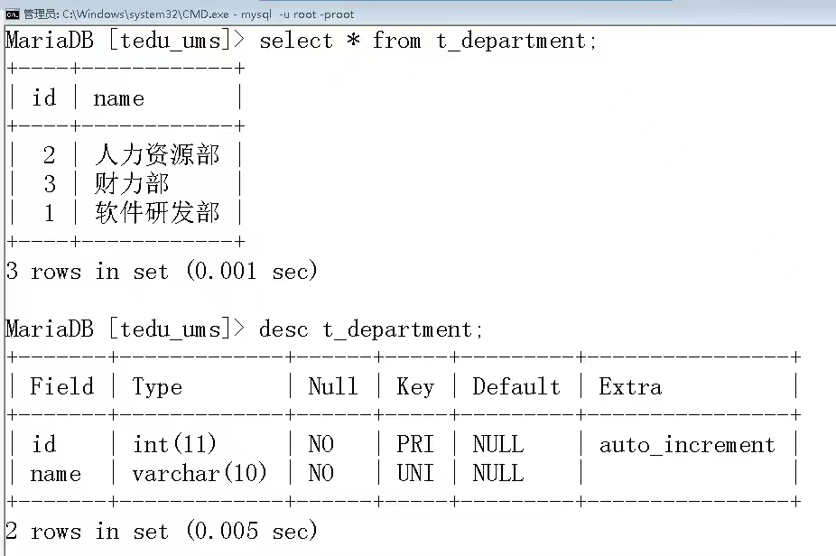

# 14. 添加与Mybatis相关的配置

在每个项目中，当需要使用Mybatis实现数据库编程时，都需要添加2项一次性配置：配置Mapper接口所在的包（`package`）、配置XML文件在哪里。

关于配置Mapper接口所在的包，可以（以下做法二选一即可）：

- 【推荐】在配置类上使用`@MapperScan`注解，并指定注解的参数，此参数值就是包名
- 在每个Mapper接口上添加`@Mapper`注解

则在项目的根包下创建`config.MybatisConfiguration`类，在此类上添加`@Configuration`注解，则可以将此类标记为“配置类”，然后，再添加`@MapperScan`注解来指定Mapper接口所在的包：

```java
package cn.tedu.csmall.product.config;

import org.mybatis.spring.annotation.MapperScan;
import org.springframework.context.annotation.Configuration;

@Configuration
@MapperScan("cn.tedu.csmall.product.mapper")
public class MybatisConfiguration {
}
```

**提示：**目前还没有创建任何Mapper接口，甚至，用于存放Mapper接口的`mapper`子包都是不存在，但这并不影响以上配置！后续在创建Mapper接口时，保证创建的接口都在以上配置值对应的包中即可！

另外，关于“配置XML文件在哪里”，需要通过配置文件（`application.properties` / `application.yml` / 相关Profile文件）中的`mybatis.mapper-locations`进行配置。由于此项配置的值，不会因为切换开发环境、测试环境等环境而变化，也不会因为使用不同的电脑来开发而变化，所以，应该将其配置在主配置文件中！

先在`src/main/resources`下创建`mapper`文件夹，此文件夹将用于存放配置SQL语句的XML文件。

在`application.yml`中添加配置：

```yaml
mybatis:
  mapper-locations: classpath:mapper/*.xml
```

# 15. 使用Mybatis访问数据

## 15.1. Mybatis的基本使用步骤

首先，需要创建接口，通常每张数据表都有一个对应的Mapper接口，并在接口中声明抽象方法。

关于抽象方法的声明：

- 返回值类型：如果要执行的数据访问操作是增、删、改类型的，始终使用`int`作为返回值类型，表示“受影响的行数”，如果不关心“受影响的行数”，也可以使用`void`作为返回值类型，但并不推荐；如果要执行数据访问操作是查询类型的，只需要保证返回值类型能够“放得下”查询结果即可。

  - 提示：非统计类型的查询，一般不建议使用实体类作为返回值类型，应该使用其它POJO类型，《阿里巴巴Java开发手册》提供的**参考**：

    ```
    1） 数据对象：xxxDO，xxx 即为数据表名。
    2） 数据传输对象：xxxDTO，xxx 为业务领域相关的名称。
    3） 展示对象：xxxVO，xxx 一般为网页名称。
    4） POJO 是 DO/DTO/BO/VO 的统称，禁止命名成 xxxPOJO。
    ```

    另外，关于POJO的后缀，必须每个字母都是大写的，《阿里巴巴Java开发手册》提供的**强制**规定：

    ```
    【强制】类名使用 UpperCamelCase 风格，必须遵从驼峰形式，但以下情形例外：DO / BO /
    DTO / VO / AO
    正例：MarcoPolo / UserDO / XmlService / TcpUdpDeal / TaPromotion
    反例：macroPolo / UserDo / XMLService / TCPUDPDeal / TAPromotion
    ```

  - 通常，每张数据表都至少有2个`VO`类（或使用其它后缀），分别用于表示查询详情、查询列表项的结果类型

- 方法名称：自定义，建议不要重载，《阿里巴巴Java开发手册》提供的**参考**：

  ```
  1） 获取单个对象的方法用 get 做前缀。
  2） 获取多个对象的方法用 list 做前缀。
  3） 获取统计值的方法用 count 做前缀。
  4） 插入的方法用 save/insert 做前缀。
  5） 删除的方法用 remove/delete 做前缀。
  6） 修改的方法用 update 做前缀。
  ```

- 参数列表：取决于要执行的SQL语句中有哪些参数，如果参数的数量超过1个，且具有明确的相关性，建议使用封装的类型作为抽象方法的参数

  - 通常，插入单条数据、修改单条数据时，使用实体类作为抽象方法的参数
  - 如果涉及批量数据操作，例如批量删除、批量更新、批量插入等，可以使用数组、可变参数或`List`集合表示若干个参数值

然后，需要准备好XML文件，在XML文件中配置抽象方法映射的SQL语句。

关于XML文件，应该是从此前的项目中复制过来再修改，因为此文件需要固定的头部声明，即：


关于此类文件，可以从 http://doc.canglaoshi.org/config/Mapper.xml.zip 下载，或在网上搜索相关文章，或在Mybatis官网上找到示例代码，都可以得到以上固定的代码片段。

关于此XML文件的内部：

- 根标签必须是`<mapper>`，且此标签必须配置`namespace`属性，取值为对应的接口的**全限定名（包名加类名）**

- 在根标签的子级，可以使用`<insert>` / `<delete>` / `<update>` / `<select>`这些标签来配置增、删、改、查对应的SQL语句，这些标签都必须配置`id`属性，取值为对应的抽象方法的名称
  
  - 其实，`<update>`和`<delete>`这2个标签可以随意调换使用，例如，配置`DELETE`语句可以使用`<update>`标签，甚至，在不考虑获取自动编号的ID时，`<insert>`标签和`<update>`、`<delete>`也可以随意调用使用，因为这3种数据访问操作在JDBC的底层实现是一样的，当然，这种乱用的方式肯定是非常不建议的
  
- 在`<insert>`这4种标签的子级，编写SQL语句，参数部分使用`#{名称}`格式的占位符来表示，其中，占位符中的“名称”应该是参数名称，或封装类型中的属性名
  
- 严格说来，在`#{}`格式的占位符中的名称，将被用于生成Setter & Getter的名称，然后，Mybatis框架会自动调用相关方法
  
- 如果配置的是`<insert>`标签，并且，插入数据的表的主键是自动编号的，应该在此标签上配置`useGeneratedKeys="true"`和`keyProperty="主键属性"`这2个属性，以获取自动编号的ID值

- 如果涉及批量操作，需要通过`<foreach>`标签来遍历参数对象，关于此标签的使用：

  - `collection`属性：表示被遍历的对象，当抽象方法的参数只有1个，且没有添加`@Param`注解时，如果参数是数组或可变参数，则此属性的值为`array`，如果参数是`List`集合，则此属性的值为`list`；当抽象方法的参数超过1个，需要添加`@Param`注解，则此属性的值为注解的配置值
  - `item`属性：表示遍历过程中各元素的名称，是自定义名称，并且，在`<foreach>`子级的`#{}`占位符中，也使用此名称表示被遍历到的元素
  - `separator`属性：表示遍历过程中各值之间的分隔符号
  - `<foreach>`标签是Mybatis的“动态SQL”标签之一

- 关于动态SQL的`<if>`标签，可以对参数进行判断，从而确定SQL语句中应该包含或不包含哪些片段

  - 需要注意，没有所谓的`else`标签，如果一定要实现类似Java中`if...else...`的效果，可以使用2个条件完全相反的`<if>`标签（虽然执行效率会差一些），或者，使用`<choose>`系列标签，语法格式如下：

    ```xml
    <choose>
    	<when test="条件">
        	满足条件时的SQL片段
        </when>
        <otherwise>
        	不满足条件时的SQL片段
        </otherwise>
    </choose>
    ```

- 如果涉及修改数据的操作，当使用了`<if>`实现动态SQL时，通常，应该使用`<set>`标签将更新列表框住，并且，SQL语句中不需要写`SET`关键字

- 如果配置的是`<select>`标签，此标签必须配置`resultType`或`resultMap`这2个属性中的某1个

  - 当`resultType`的值是基本数据类型时，直接使用类型名称作为此属性值即可，例如`resultType="int"`
  - 当`resultType`的值是引用数据类型时，需要使用类型的全限定名作为此属性值，例如`resultType="cn.tedu.xxx.User"`，但是，如果类型是`java.lang`包下的，则可以不写包名，例如`resultType="Integer"`

- 在编写查询的SQL语句时，可以使用`<sql>`标签封装查询的字段列表，并使用`<include>`标签来引用封装的查询字段列表

  - 由于IntelliJ IDEA会检查每个标签的子级内容的语法，所以，在`<sql>`标签下直接写字段列表，IntelliJ IDEA会提示错误，但是并不影响运行，可以使用`<if test="true">`将字段列表框住，以“欺骗”IntelliJ IDEA使之不报错
  - 通常，在`<include>`标签的子级并不编写任何代码，所以，此标签推荐使用单标签格式

- 建议为所有的“非统计查询”配置`<resultMap>`

## 15.2. 关于SQL语句的编写规范

关于`INSERT`语句：

- 使用`INSERT INTO`开头，不要省略`INTO`关键字
- 使用`VALUES`，不要使用`VALUE`
- 显式写出字段列表，不要省略字段列表

关于`SELECT`语句：

- 统计查询时，`count()`函数内必须使用星号

- 不允许使用星号（`*`）表示被查询的字段列表

- 查询列表时，必须显式的使用`ORDER BY`指定排序规则，如果没有使用`ORDER BY`，则排序结果是不可控的，并且，在使用`ORDER BY`指定排序规则时，如果第1排序规则无法明确的区分所有数据的顺序，还应该指定第2排序规则，甚至第3排序规则等，直至所有数据都有明确的排序规则

  

## 15.3. 关于编写SQL语句时的代码提示

首先，需要在IntelliJ IDEA中，为当前项目配置Database面板，且Database面板中仅有当前使用的这1个数据库。

然后，需要在设置中，指定SQL方言（Dialect），即：


**提示：**如果完成以上配置，在XML文件中编写SQL语句仍没有提示，可以尝试删除并重新配置Database面板，或将方言在MariaDB和MySQL之间切换。

## 15.4. 使用测试检验开发的数据访问功能

在Spring Boot项目中，所有的测试类都应该创建在`src/test/java`下的根包（创建项目时就存在的包，与`src/main/java`下的根包是相同的）下。

在Spring Boot项目中，当需要执行的测试是基于加载整个项目环境的（例如需要读取配置文件、需要使用`@Autowired`自动装配等），测试类必须添加`@SpringBootTest`注解。

**注意：**由于`src/test/java`下的根包与`src/main/java`下的根包是相同的，所以，任何测试类都不要和被测试类的名称相同，一般，测试类的名称建议添加`Tests`作为最后一个单词，例如`AlbumMapperTests`。

例如，在`src/test/java`下的根包下创建`mapper.AlbumMapperTests`类，在类上添加`@SpringBootTest`注解，然后，在类中对`AlbumMapper`接口中定义的功能进行测试：

```java
package cn.tedu.csmall.product.mapper;

import cn.tedu.csmall.product.pojo.entity.Album;
import org.junit.jupiter.api.Test;
import org.springframework.beans.factory.annotation.Autowired;
import org.springframework.boot.test.context.SpringBootTest;

@SpringBootTest
public class AlbumMapperTests {

    @Autowired
    AlbumMapper mapper;

    @Test
    void insert() {
        Album album = new Album();
        album.setName("测试名称001");
        album.setDescription("测试简介001");
        album.setSort(100); // 注意：由于MySQL中表设计的限制，此值只能是[0,255]区间内的

        int rows = mapper.insert(album);
        System.out.println("插入数据完成，受影响的行数：" + rows);
    }

}
```

## 15.5. 使用Mybatis的常见错误

如果Mapper接口不在`@MapperScan`指定的包下，或根本没有配置`@MapperScan`，总之，Mybatis找不到Mapper接口时，会出现错误：

```
Caused by: org.springframework.beans.factory.NoSuchBeanDefinitionException: No qualifying bean of type 'cn.tedu.csmall.product.mapper.AlbumMapper' available: expected at least 1 bean which qualifies as autowire candidate. Dependency annotations: {@org.springframework.beans.factory.annotation.Autowired(required=true)}
```

如果存在以下问题：

- 在XML文件中`<mapper>`标签的`namespace`值有误
- 在XML文件中`<insert>`这类标签的`id`值有误
- 在配置文件中`mybatis.mapper-locations`属性的值有误

总之，当Mybatis找不到抽象方法映射的SQL语句时，会出现错误：

```
org.apache.ibatis.binding.BindingException: Invalid bound statement (not found): cn.tedu.csmall.product.mapper.AlbumMapper.insert
```

如果配置SQL语句时，在`#{}`格式的占位符中，名称写错时，会出现错误：

```
Caused by: org.apache.ibatis.reflection.ReflectionException: There is no getter for property named 'nama' in 'class cn.tedu.csmall.product.pojo.entity.Album'
```

如果配置`<select>`标签时，既没有配置`resultType`又没有配置`resultMap`，会出现错误：

```
Caused by: org.apache.ibatis.executor.ExecutorException: A query was run and no Result Maps were found for the Mapped Statement 'cn.tedu.csmall.product.mapper.AlbumMapper.count'.  It's likely that neither a Result Type nor a Result Map was specified.
```

 如果配置`<select>`标签时，使用`resultType`，但值却是某个`<resultMap>`的id，或是错误的全限定名，会出现错误：

```
Caused by: java.lang.ClassNotFoundException: Cannot find class: StandardResultMap
```

 如果配置`<select>`标签时，使用`resultMap`，但值却是某个类名，或是其它错误值，只要不是某个`<resultMap>`的id值，会出现错误：

```
java.lang.IllegalArgumentException: Result Maps collection does not contain value for cn.tedu.csmall.product.pojo.vo.AlbumStandardVO
```

如果某个抽象方法对应的SQL语句的配置存在多个（通常可能是因为复制粘贴代码，但没有修改对应关系导致的，例如忘记修改新的XML文件中的`namespace`值等），会出现错误（这个错误，不仅仅只看最后一个`Caused by`，偏上的`Caused by`也有参考价值，会告诉你是哪些文件中出现了对应同一个抽象方法的配置）：

```
Caused by: org.apache.ibatis.builder.BuilderException: Error parsing Mapper XML. The XML location is 'file [D:\IdeaProjects\jsd2209-csmall-product-teacher\target\classes\mapper\BrandMapper.xml]'. Cause: java.lang.IllegalArgumentException: Result Maps collection already contains value for cn.tedu.csmall.product.mapper.AlbumMapper.StandardResultMap

Caused by: java.lang.IllegalArgumentException: Result Maps collection already contains value for cn.tedu.csmall.product.mapper.AlbumMapper.StandardResultMap
```

# 16. 关于SLF4j日志

在开发实践中，通常是禁止使用`System.out.println()`这种语句输出信息的，主要原因有：

- 不易控：在开发过程中，可能会通过这样的语句输出某些变量值，或输出程序的执行过程，这些输出的内容可能仅适用于开发过程中，当项目实际部署上线，就不再应该甚至不允许输出这些内容，因为输出的变量值可能是敏感信息，或程序的执行过程不应该被暴露出来
- 执行效率低下

在Spring Boot项目中，基础依赖项（`spring-boot-starter`）中已经包含了日志相关的依赖项，可以直接使用日志框架来输出信息！

在添加了Lombok后，在任何类的声明之前，添加`@Slf4j`注解，则编译期会自动声明一个名为`log`的变量，所以，可以在类中通过此变量来输出日志。

如果没有使用Lombok，可以自行声明日志变量，例如：

```java
private static Logger logger = LoggerFactory.getLogger(Slf4jTests.class);
```

在日志框架中，根据日志信息的重要程度，从不太重要，到非常重要，划分了几个等级，依次是：

- `trace`：跟踪信息
- `debug`：调试信息
- `info`：一般信息
- `warn`：警告信息
- `error`：错误信息

在调用`log`变量的方法来输出日志时，有以上5个级别对应的方法，调用不同的方法，就会输出不同级别的日志。

在没有加载Spring Boot的情况下，日志的默认显示级别是`debug`，只会显示此级别及更加重要的级别的日志，如果加载了Spring Boot（例如在测试类上添加了`@SpringBootTest`注解），日志的默认显示级别是`info`，则只会显示`info`、`warn`、`error`级别的日志，不会显示`trace`、`debug`级别的日志。

在Spring Boot项目中，可以在配置文件（`application.properties` / `application.yml` / 相关Profile配置）中配置`logging.level.包名`属性，以指定某个包下的所有类的默认日志显示级别，此属性的值为5个级别中的某1个。

例如，在`application-dev.yml`添加配置（另外，你可以在其它Profile配置中为日志的显示级别配置不同的值）：

```yaml
logging:
  level:
    cn.tedu.csmall: trace
```

**提示：**当配置包名时，不必把包名配置得特别具体，可以作用于其子孙包下所有的类，但是，必须至少配置1级包名，例如配置到`cn`这一级包，不可以完全不配置包名，需要注意，当前项目中添加的所有依赖项，也是当前项目的一部分，不应该将包名配置得过于简单，例如只使用`cn`作为配置的包名。

**提示：**Mybatis框架会生成各Mapper接口的对象，这些对象在执行SQL语句时，也会输出日志，是`trace`和`info`级别的日志，当把日志的显示级别设置为较低的级别时，可以看到这些日志。

在调用日志的方法时，如果输出的信息中包含变量值，推荐使用`trace(String message, Object... args)`方法（其它级别也是同样参数列表的方法），在`String message`参数中，可以使用`{}`作为占位符，表示此处是一个变量值，然后，通过`Object... args`依次传入各占位符对应的值，例如：

```java
int x = 1;
int y = 2;
System.out.println("x = " + x + ", y = " + y + ", x + y = " + (x + y)); // 传统做法
log.info("x = {}, y = {}, x + y = {}", x , y , x + y); // 使用日志输出变量的做法
```

以上使用日志输出时，不会涉及到字符串的拼接，所以，执行效率会更高，并且，以上方法的第1个参数是字符串常量，是在内存中的字符串常量池中的，也可以一定程度上提高执行效率。

另外，SLF4j其实是一种日志框架的标准，并没有具体实现日志的输出功能，通常，是使用`log4j`或`logback`这些日志框架来实现具体功能的！


