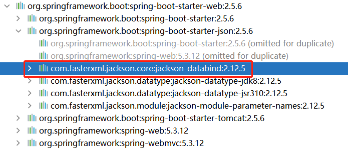

# 23. 关于响应结果

目前，当成功的添加相册后，服务器端响应的结果是：

```
添加相册成功！
```

如果相册名称已经被占用，服务器端响应的结果是：

```
添加相册失败，相册名称已经被占用！
```

以上的响应结果是**不合适的**，因为客户端不便于通过以上结果判断本次请求是否被成功的处理了，或是处理结果是失败。

如果服务器端改为使用数字作为响应结果，与客户端协商不同的数字所表示的意义，例如使用`1`表示成功，使用`0`表示失败，这种做法更利于客户端判断操作成功与否，但是，却需要客户端自行组织后续的文本，以在界面上显示相关提示，而客户端自行组织文本也是不适合的，特别是操作失败时，仍应该是“谁抛出，谁描述”，客户端不一定能准确的、统一的组织这些文本，所以，仍应该是由服务器端响应操作失败的描述文本！

所以，服务器端响应的结果中应该既包含数字这类标志着成功与失败的数据，还应该包含描述文本！

由于服务器端响应的结果中包含多个部分（目前是2个部分：数字标志、描述文本），应该将这多个部分使用JSON格式组织起来，则客户端收到后，可以从中取出任何所需的部分的数据：

```json
{ 
    "state": "1", 
    "message": "添加相册成功！""
}
```

在Spring MVC框架中，当需要向客户端响应JSON格式的数据时，需要：

- 处理请求的方法必须是**响应正文**的

  - 在方法上添加`@ResponseBody` / 在控制器类上添加`@ResponseBody` / 在控制器类上添加`@RestController`

- 开启注解驱动

  - 如果是使用XML配置的Spring MVC项目，需要在XML配置文件中添加`<annotation-driven/>`
  - 如果是使用注解配置的Spring MVC项目，需要在配置类上添加`@EnableWebMvc`
  - 如果是Spring Boot项目，不需要添加任何配置

- 添加`jackson-databind`依赖项

  - 在`spring-boot-starter-web`依赖项中包含此依赖项：

    

- 使用自定义的数据类型作为处理请求的方法的返回值类型

则在项目的根包下创建`web.JsonResult`类（类名是完全自定义的），并在类中声明需要响应到客户端的数据属性，也可以理解为声明期望响应的JSON数据中的属性：

```java
@Data
public class JsonResult implements Serializable {
    private Integer state;
    private String message;
}
```

然后，将处理请求的方法的返回值类型改为`JsonResult`，并调整内部实现，处理完请求后返回此类型的对象：

```java
@PostMapping("/add-new")
public JsonResult addNew(AlbumAddNewDTO albumAddNewDTO) {
    try {
        albumService.addNew(albumAddNewDTO);
        JsonResult jsonResult = new JsonResult();
        jsonResult.setState(1);
        jsonResult.setMessage("添加相册成功！");
        return jsonResult;
    } catch (ServiceException e) {
        JsonResult jsonResult = new JsonResult();
        jsonResult.setState(0);
        jsonResult.setMessage(e.getMessage());
        return jsonResult;
    }
}
```

完成后，重启项目，再次通过API文档调试访问，当添加相册成功时，响应结果为：

```json
{
  "state": 1,
  "message": "添加相册成功！"
}
```

当相册名称已经被占用，导致添加失败时，响应结果为：

```json
{
  "state": 0,
  "message": "添加相册失败，相册名称已经被占用！"
}
```

# 24. 使用静态方法创建JsonResult对象

在处理响应时，每次都需要创建对象、为属性赋值、返回对象，使用了较多语句实现此效果，在语法上过于繁琐，应该简化此类代码！

可以在`JsonResult`类中添加全参数构造方法（在类上添加`@AllArgsConstructor`注解，出于规范性，也添加`@NoArgsConstructor`），以简化相关代码，例如：

```java
@Data
@NoArgsConstructor
@AllArgsConstructor
public class JsonResult implements Serializable {

    private Integer state;
    private String message;

}
```

则处理请求的响应代码可以简化：

```java
@PostMapping("/add-new")
public JsonResult addNew(AlbumAddNewDTO albumAddNewDTO) {
    try {
        albumService.addNew(albumAddNewDTO);
        return new JsonResult(1, "添加相册成功！");
    } catch (ServiceException e) {
        return new JsonResult(0, e.getMessage());
    }
}
```

关于`JsonResult`中的`String message`属性，其作用是避免客户端在描述“失败”时组织的文本不统一，或不准确，在“成功”时，其实并不需要此属性，因为在操作成功时，由客户端自行组织描述文本，通常不会出现歧义，甚至，在许多业务中，操作成功后，只需要让客户端的软件界面发生变化即可，并不需要提示一段信息！

同时，为了进一步更好的管理状态码，应该将这些状态码定义在专门的类型中，例如，在项目的根包下创建`web.ServiceCode`类，用于管理各个可能使用到的业务状态码：

```java
public interface ServiceCode {
    Integer OK = 10000;
    Integer ERR = 20000;
}
```

**提示：**以上类型声明为接口，可以不必在每个常量上添加`public static final`这些修饰符。

在`JsonResult`类中，可以定义一些静态方法，以快速的创建对象，并为属性赋值，例如：

```java
@Data
public class JsonResult implements Serializable {

    private Integer state;
    private String message;

    public static JsonResult ok() {
        JsonResult jsonResult = new JsonResult();
        jsonResult.setState(ServiceCode.OK);
        return jsonResult;
    }

    public static JsonResult fail(Integer state, String message) {
        JsonResult jsonResult = new JsonResult();
        jsonResult.setState(state.getValue());
        jsonResult.setMessage(message);
        return jsonResult;
    }
}
```

**提示：**相比构造方法，以上静态方法的方法名是可以自由定义的，可以更好的表现代码的语义。

在控制器类中的代码则调整为：

```java
@PostMapping("/add-new")
public JsonResult addNew(AlbumAddNewDTO albumAddNewDTO) {
    try {
        albumService.addNew(albumAddNewDTO);
        return JsonResult.ok();
    } catch (ServiceException e) {
        return JsonResult.fail(ServiceCode.ERR, e.getMessage());
    }
}
```

# 25. 使用枚举限制参数的传入

经过以上调整，各状态码可以集中的管理起来，控制器类中的语法也可以清晰的表现语义，但是，无法避免方法的调用者传值错误的问题，例如，在`JsonResult`类中的`fail()`方法的第1个参数仍是`Integer`类型的：

```java
public static JsonResult fail(Integer state, String message) {
    JsonResult jsonResult = new JsonResult();
    jsonResult.setState(state);
    jsonResult.setMessage(message);
    return jsonResult;
}
```

方法的调用者可能不清楚“必须传入`ServiceCode`中的某个常量值”这样的约定，则可能错误的传入值，例如：

```java
//                     ↓↓↓↓↓↓↓ 错误的传值
return JsonResult.fail(1234567, e.getMessage());
```

**提示：**枚举的本质是一种“穷举”，如果你认为某个数据的取值是相对有限的可能性，则可以考虑使用枚举。

可以将`ServiceCode`改为枚举类型，例如：

```java
public enum ServiceCode {

    // 注意：每一个枚举值，其实都是当前枚举类型的对象
    // 注意：请将以下语法理解为“通过带参数的构造方法创建枚举类型的对象”
    // 注意：由于通过构造方法传入了值，所以，每个枚举类型的对象都带有一个数字值，后续可以getValue()取出
    OK(10000),
    ERR(20000);

    // 以下属性，表示每个枚举类型的对象都有一个Integer value属性，此属性的值将通过构造方法传入
    private Integer value;

    // 显式的声明枚举的带Integer参数的构造方法，用于创建枚举类型的对象时，为其Integer value属性赋值
    // 注意：枚举的构造方法的访问权限固定是私有的（Java语法特征）
    //      不写访问权限，并不表示“默认的”，而是“私有的”
    //      写public / protected是错误的
    //      写private是多余的
    ServiceCode(Integer value) {
        this.value = value;
    }

    // 用于通过枚举对象获取Integer value属性的值
    public Integer getValue() {
        return value;
    }

}
```

并且，将`fail()`方法的参数设计为枚举类型：

```java
//                            ↓↓↓↓↓↓↓↓↓↓↓ 由原本的Integer改为ServiceCode
public static JsonResult fail(ServiceCode serviceCode, String message) {
    // 暂不关心内部代码
}
```

则方法的调用者只能传入`ServiceCode`中的某个枚举值，不可以传入任意值！

在`ok()`和`fail()`方法的内部，可以调用枚举值的`getValue()`方法，得到各枚举值对应的数值：

```java
public static JsonResult ok() {
    JsonResult jsonResult = new JsonResult();
    //                                ↓↓↓↓↓↓↓↓↓↓↓ 调用枚举对象的getValue()
    jsonResult.setState(ServiceCode.OK.getValue());
    return jsonResult;
}

public static JsonResult fail(ServiceCode serviceCode, String message) {
    JsonResult jsonResult = new JsonResult();
    //                              ↓↓↓↓↓↓↓↓↓↓↓ 调用枚举对象的getValue()
    jsonResult.setState(serviceCode.getValue());
    jsonResult.setMessage(message);
    return jsonResult;
}
```

至此，既保证了响应的业务状态码（`JsonResult`中的`state`）是数值类型的，又保证了传入的值只能是限定的某个值（只能是`ServiceCode`中列举的某个值）。

# 26. 关于枚举值的状态码

各枚举值的状态码虽然是自由定义的，但强烈推荐是有一定规律的！

如果没有更合适的规律，可以参考HTTP状态，例如，在HTTP状态码中，`200`表示“成功”的意义，`404`表示“不存在”的意义，`409`表示“冲突”的意义，则可以将枚举值改为：

```java
public enum ServiceCode {

    OK(20000),
    ERR_NOT_FOUND(40400),
    ERR_CONFLICT(40900);
 
    // 暂不关心此类型中的其它代码
}
```

# 27. 调整ServiceException

关于异常的描述文本，应该是“谁抛出，谁描述”，而业务状态码（`JsonResult`中的`state`，或，`ServiceCode`的值）也应该是“谁抛出，谁定值”，而不应该是由捕获异常的一方来决定业务状态码，而现有的代码是：

```java
@PostMapping("/add-new")
public JsonResult addNew(AlbumAddNewDTO albumAddNewDTO) {
    try {
        albumService.addNew(albumAddNewDTO);
        return JsonResult.ok();
    } catch (ServiceException e) {
        //                     ↓↓↓↓↓↓↓↓↓↓↓↓↓↓↓↓↓↓↓↓↓↓↓↓ 捕获异常时确定业务状态码，是“不合适”的
        return JsonResult.fail(ServiceCode.ERR_CONFLICT, e.getMessage());
    }
}
```

目前，抛出的异常对象中只包含“描述文本”，如果还要包含“业务状态码”，则应该调整异常类型的源代码：

```java
public class ServiceException extends RuntimeException {

    private ServiceCode serviceCode;

    public ServiceException(ServiceCode serviceCode, String message) {
        super(message);
        this.serviceCode = serviceCode;
    }

    public ServiceCode getServiceCode() {
        return serviceCode;
    }

}
```

以上调整的思路：

- 在异常类型中声明`ServiceCode`属性，表示此类型的异常中将包含“业务状态码”
- 调整现有的构造方法，添加`ServiceCode`类型的参数，表示强制要求传入此值，否则不允许创建此类型的异常对象
- 为了便于后续获取到此类型的异常对象中通过构造方法传入的`ServiceCode`值，还需要添加Getter方法

完成后，当需要抛出异常时，必须通过以上的唯一的构造方法，例如在`AlbumServiceImpl`的`addNew()`方法中调整：

```java
if (countByName > 0) {
    String message = "添加相册失败，相册名称已经被占用！";
    log.warn(message);
    //                         ↓↓↓↓↓↓↓↓↓↓↓↓↓↓↓↓↓↓↓↓↓↓↓↓ 创建异常对象时传入业务状态码
    throw new ServiceException(ServiceCode.ERR_CONFLICT, message);
}
```

后续，当处理异常时，可以调用捕获到的异常对象的`getServiceCode()`方法得到业务状态码，例如在`AlbumController`中处理“添加相册”的请求时：

```java
@PostMapping("/add-new")
public JsonResult addNew(AlbumAddNewDTO albumAddNewDTO) {
    try {
        albumService.addNew(albumAddNewDTO);
        return JsonResult.ok();
    } catch (ServiceException e) {
        //                     ↓↓↓↓↓↓↓↓↓↓↓↓↓↓↓↓↓↓ 从异常对象中取出业务状态码
        return JsonResult.fail(e.getServiceCode(), e.getMessage());
    }
}
```

为了进一步简化`JsonResult`的调用，可以在`JsonResult`类中重载`fail()`方法：

```java
public static JsonResult fail(ServiceException e) {
    // JsonResult jsonResult = new JsonResult();
    // jsonResult.setState(e.getServiceCode().getValue());
    // jsonResult.setMessage(e.getMessage());
    // return jsonResult;
    return fail(e.getServiceCode(), e.getMessage());
}
```

**提示：**原本的`fail(ServiceCode serviceCode, String message)`仍需要保留下来，后续出现其它异常时需要使用到。

当添加了以上新的`fail()`方法后，在`AlbumController`中捕获并处理异常的代码可以简化：

```java
@PostMapping("/add-new")
public JsonResult addNew(AlbumAddNewDTO albumAddNewDTO) {
    try {
        albumService.addNew(albumAddNewDTO);
        return JsonResult.ok();
    } catch (ServiceException e) {
        //                     ↓ 只需要传入整个异常对象即可
        return JsonResult.fail(e);
    }
}
```

# 28. Spring MVC的统一处理异常机制

在Spring MVC中，存在统一处理异常的机制，具体表现为：无论是哪个处理请求的过程中出现异常，每种类型的异常只需要编写一段处理异常的代码即可！

统一处理异常的核心是定义处理异常的方法：

- 返回值类型：可参考处理请求的方法
- 方法名称：自定义
- 参数列表：至少包含被处理的异常对象，另外，可按需添加`HttpServletRequest`、`HttpServletResponse`等少量特定的参数，当存在多个参数时，各参数不区分先后顺序
- 注解：必须添加`@ExceptionHandler`注解，表示此方法是处理异常的方法

例如：

```java
@ExceptionHandler
public JsonResult handleServiceException(ServiceException e) {
    log.warn("程序运行过程中出现ServiceException，将统一处理！");
    log.warn("异常信息：{}", e.getMessage());
    return JsonResult.fail(e);
}
```

当客户端向服务器端提交请求，例如“添加相册”，如果服务器端的控制器中处理请求的方法中调用Service方法时出现异常，但是，处理请求的方法不必对此异常进行处理，例如：

```java
@PostMapping("/add-new")
public JsonResult addNew(AlbumAddNewDTO albumAddNewDTO) {
    log.debug("开始处理【添加相册】的请求，参数：{}", albumAddNewDTO);
    albumService.addNew(albumAddNewDTO); // 此次调用可能出现异常，但并不需要try...catch
    return JsonResult.ok();
}
```

当处理请求的方法不使用`try..catch...`捕获异常，如果出现异常，相当于此处理请求的方法会抛出异常！

在Spring MVC框架中，处理请求的方法都是被框架所调用的，所以，处理请求的方法抛出的异常也都会被框架捕获到，则框架会自动的使用此异常对象来调用处理异常的方法！类似于：

```java
try {
    框架.addNew(); // 框架调用了控制器类中处理异常的方法
} catch (ServiceException e) {
    框架.handleServiceException(e); // 框架调用了处理异常的方法
}
```

需要注意：如果将处理异常的方法定义在某个控制器类中，将只能作用于当前控制器类所有处理请求时出现的异常，并不能作用于其它控制器类中处理请求时出现的异常！

在使用Spring MVC框架时，可以在类上添加`@RestControllerAdvice`注解，此类中特定的方法（例如统一处理异常的方法）将可以作用于整个项目中任何处理请求的过程中！

在项目的根包下创建`ex.handler.GlobalExceptionHandler`类，作为当前项目的“全局异常处理器”类，将统一处理异常的代码编写在此类中（各控制器类中不再需要重复的处理异常的方法）：

```java
@Slf4j
@RestControllerAdvice
public class GlobalExceptionHandler {

    @ExceptionHandler
    public JsonResult handleServiceException(ServiceException e) {
        log.warn("程序运行过程中出现ServiceException，将统一处理！");
        log.warn("异常信息：{}", e.getMessage());
        return JsonResult.fail(e);
    }

}
```

# 29. 关于响应结果中的null值

目前，服务器端处理完请求后，会向客户端响应JSON格式的结果，但是，某些情况下，会有一些属性的值为`null`，例如，当成功的添加相册后，响应的结果是：

```json
{
  "state": 20000,
  "message": null
}
```

以上`message`属性是没有必要响应的，因为此属性的作用是“失败”时的提示文本，当操作成功时，此属性的值一定是`null`值，将此属性响应到客户端去是没有任何意义的！

可以在响应结果对应的属性上配置`@JsonInclude`注解，例如：

```java
@Data
public class JsonResult implements Serializable {

    private Integer state;
    
    // @JsonInclude用于配置“此属性什么时候会包含在JSON结果中”
    // NON_NULL 表示 不为null的时候
    @JsonInclude(JsonInclude.Include.NON_NULL)
    private String message;
    
}
```

也可以将此注解添加在类上，则类中每个属性都是此配置：

```java
@Data
@JsonInclude(JsonInclude.Include.NON_NULL) // 在类上配置，每个属性都遵循此配置
public class JsonResult implements Serializable {

    private Integer state;
    private String message;
    
}
```

或者，还可以在配置文件中通过`spring.jackson.default-property-inclusion`属性进行作用于整个项目的全局配置！例如，在`application.yml`中添加：

```yaml
# Spring相关配置
spring:
  # jackson框架的相关配置
  jackson:
    # 服务器端响应JSON结果时，JSON结果中默认包含哪些属性
    default-property-inclusion: non_null
```

**提示：**在配置文件中、在类上、在类的属性上，都可以配置“是否包含在JSON结果中”，通常只需要在主配置文件中配置即可，但是，如果在多处都配置了，以“作用域”更小的为准，例如，在类上和在类的属性上都配置了，但配置值不同，则以在类的属性上的配置为准！