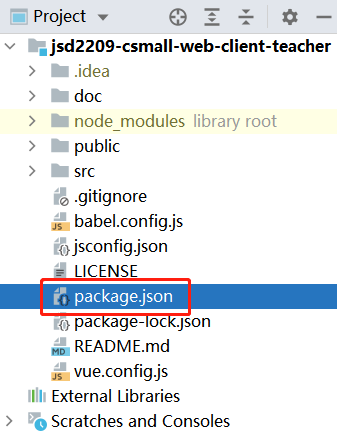
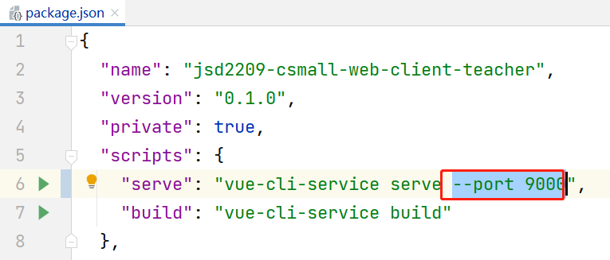
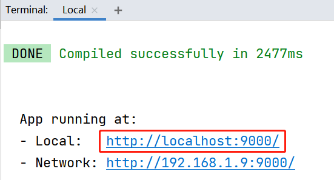
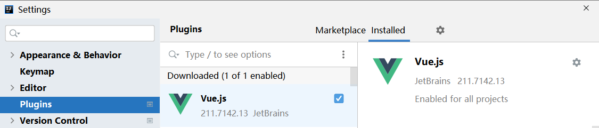
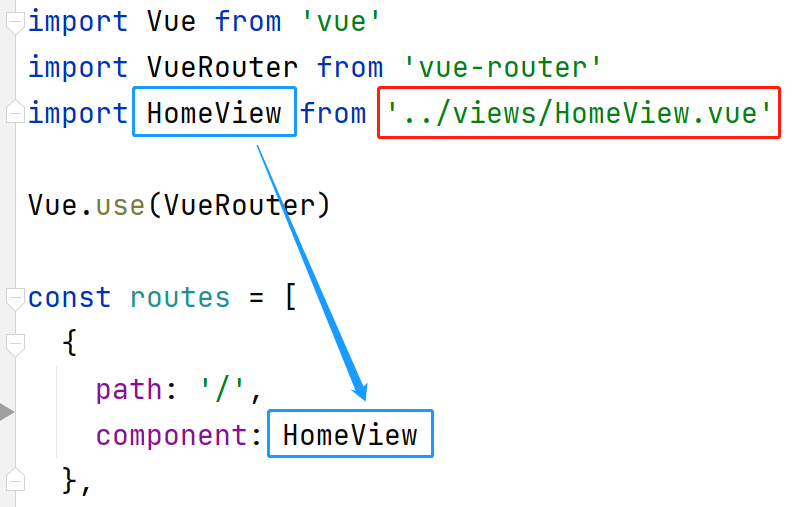
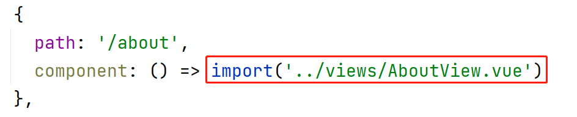
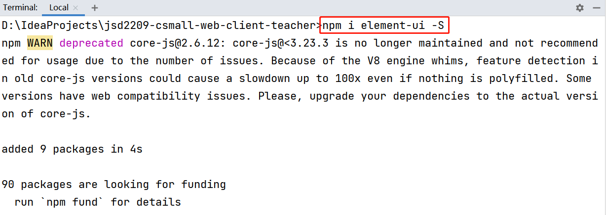
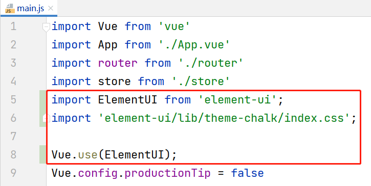

# 35. 创建VUE脚手架项目

参考《VUE Cli课前准备_软件安装篇.pdf》

# 36. 关于VUE脚手架项目

VUE脚手架项目是一个“单页面”应用，即整个项目中只有1个网页！

在VUE脚手架项目中，主要是设计各个“视图组件”，它们都是整个网页中某个部分，通过显示不同的若干个视图组件，以达到显示不同“页面”的效果！

# 37. 修改VUE脚手架项目服务端口

在项目文件夹下，找到`package.json`文件（此文件是创建项目中选择的配置文件）：



在此文件中的`scripts`属性下，修改`serve`属性的值，在原有值后追加`--port 新的端口号`，例如：



完成后，再次启动项目，将可以看到此项目启动在`9000`端口（以上的配置值）：



# 38. VUE脚手架的项目结构

VUE脚手架的项目结构为：

- `[.idea]`：任何使用IntelliJ IDEA打开过的项目都会有此文件夹，是由IntelliJ IDEA自动生成的，记录了IntelliJ IDEA管理此项目时用到的文件，如果此文件夹如现错误，删除即可，后续会自动再次生成

- `[node_modules]`：当前项目使用到的依赖项的文件夹，**不要手动管理此文件夹中的内容**，如果项目中缺失此文件夹，或此文件夹中的部分必要内容，项目将无法启动，或无法正确运行，需要在终端窗口中，在当前项目文件夹下执行`npm install`命令，将自动下载当前项目所需的所有依赖项到此文件夹中
  - 此文件夹通常被配置到`.gitignore`文件中，所以，使用GIT仓库时，提交代码时此文件夹是不会提交的！同理，从GIT仓库拉取项目到本地时，拉取到的项目也不会包含此文件夹
- `[public]`：静态资源文件夹，用于存放静态资源文件（例如`.css`、`.js`、图片等），此文件夹也是整个项目的资源根目录，此文件夹中的内容通过URL的 `/` 根路径来访问
  - `favicon.ico`：图标文件，是固定的文件名，如果你希望使用其它图标，可以使用新图标文件覆盖此文件（仍使用相同的文件名）
  - `index.html`：VUE脚手架项目中的**唯一的**网页文件，通常，不修改默认文件中的内容
- `[src]`：项目的核心源代码文件所在的文件夹
  - `[assets]`：静态资源文件夹，此文件夹下的内容被使用时应该是相对固定的，不会随着程序的运行而发生变化的，例如你可以把网站的LOGO图片文件放在这里，但不应该把用户的头像图片放在这里
  - `[components]`：用于存放**被其它视图组件调用的**视图组件的文件夹
  - `[router]`：用于配置路由
    - `index.js`：默认的路由配置文件
  - `[store]`：用于配置全局的一些量
    - `index.js`：默认的配置全局的量的文件
  - `[views]`：用于存放视图组件的文件夹
  - `App.vue`：是默认会注入到`index.html`的视图组件，**不要修改此文件的文件名**
  - `main.js`：项目的主配置文件，通常，在安装了某些新的依赖项后，可能需要在此文件中添加一些配置

- `.gitignore`：用于配置将哪些文件或文件夹忽略，不会提交到GIT仓库
- `bable.config.js`：Bable的配置文件
- `jsconfig.json`：JavaScript的基础配置文件
- `LICENSE`：并不是VUE脚手架项目的必要文件，此文件是开源声明文件，当你的项目提交到GIT仓库并且设置为公开项目时，需要添加此文件
- `package.json`：此项目的配置文件，主要配置了执行脚本（`scripts`属性）、项目的依赖项（`dependencies`属性）、开发时所需的依赖项（`devDependencies`属性），**在不熟练的情况下，不要手动修改此文件中的内容**
- `package-lock.json`：是管理此项目时使用的、基于`package.json`自动生成的文件
- `README.md`：是默认的项目的介绍文件，当你的项目提交到GIT仓库，大部分GIT仓库服务器都会你的项目的首页显示此文件的内容，当你需要编写此文件时，应该明确写出：此项目应该如何打开、如果启动、如果部署，及相关的注意事项等
- `vue.config.js`：Vue的基础配置文件

# 39. 关于VUE脚手架项目视图组件

在VUE脚手架项目中，视图组件表现为：使用`.vue`作为扩展名的文件。

**提示：**推荐在IntelliJ IDEA中安装`Vue.js`插件，在编写视图组件的源代码时，可以得到更好的编码体验！



视图组件主要由3大部分组成，对应3个根级标签：

- `<template>`：用于设计页面的元素，其子级可以编写设计页面的相关代码，例如HTML源代码，或使用了VUE后的一些标签，或添加了Element UI后，也可以使用Element UI的标签，需要注意：**此标签的直接子标签只能有1个**
- `<style>`：用于设计样式，即编写CSS相关代码
- `<script>`：用于编写程序代码，即编写JavaScript相关代码

# 40. 关于VUE脚手架项目路由

VUE脚本架项目中设计了“路由”的概念，实现了“根据URL不同，加载不同的视图组件”的效果。

在默认的`src/router/index.js`中存在以下配置（代码片段）：

```javascript
import HomeView from '../views/HomeView.vue'

const routes = [
  {
    path: '/',
    name: 'home',
    component: HomeView
  },
  {
    path: '/about',
    name: 'about',
    component: () => import('../views/AboutView.vue')
  }
]
```

以上代码就将`HomeView`与`/`路径进行了映射（或称之绑定），而`AboutView`与`/about`路径进行了映射。

在默认的效果中，`HomeView`和`AboutView`之所以会显示在页面中，是因为在`App.vue`（默认会注入到`index.html`中的视图组件）中使用了`<router-view/>`标签，此标签的作用是：根据URL不同，加载对应的视图组件！

路由的配置中，以上`routes`是通过`const`声明的，所以是一个常量，并且，其数据类型是一个对象的数组，数组的每个元素都是一个“路由”对象。

每个“路由”对象至少需要配置`path`和`component`这2个属性，`path`是路径，`component`是视图组件，默认的配置中，`name`属性是可以不配置的。

关于`component`的配置，有2种做法，第1种是使用`import`语句来导入：



另一种是使用`import()`函数来导入：



通常，每个项目，使用`import`语句来导入的视图组件不多，可能只有1个，绝大多数可能是通过`import()`函数导入的。

# 41. 在VUE脚手架项目安装Element UI

在终端窗口中，在项目文件夹下，通过以下命令安装Element UI：

```
npm i element-ui -S
```

**注意：**以上命令中最后的`-S`中的字母`S`是大写的！

例如：



安装完成后，还必须在`main.js`中添加配置：

```javascript
import ElementUI from 'element-ui';
import 'element-ui/lib/theme-chalk/index.css';
Vue.use(ElementUI);
```

例如：



至此，完成了Element UI的安装与配置，则在当前项目中的任何视图组件中，可以直接使用Element UI进行设计！

以上安装与配置，对于每个VUE脚手架项目都是一次性操作。

**注意：**当你再次拉取老师的项目时，需要在老师的项目文件夹下执行`npm install`命令。


