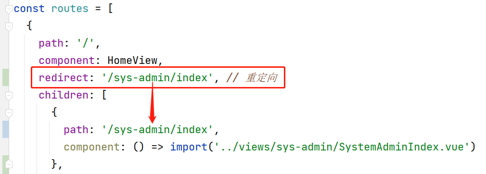

# 42. VUE脚手架项目嵌套路由

在配置路由（配置`/src/router/index.js`）时，如果配置的路由对象是`routes`常量的直接数组元素，则此路由配置的视图会显示在`App.vue`的`<router-view/>`中。

在设计视图时，可能会出现`<router-view/>`的嵌套，以本次菜单的设计为例，菜单所在的视图`HomeView.vue`是显示在`App.vue`的`<router-view/>`中的（下图中红色边框的区域），而`HomeView`本身也使用了`<router-view/>`使得页面的主要区域由其它视图组件来显示（下图中绿色边框的区域）：


一旦出现了`<router-view/>`的嵌套，在配置子级`<router-view/>`的显示的视图组件时，就需要配置嵌套路由！

子级路由的配置，需要在父级路由对象上添加`children`的属性，例如，以上是`HomeView.vue`使用了`<router-view/>`，就在`HomeView.vue`对应的路由对象上添加`children`属性，此属性的类型、配置方式与`routes`常量相同！例如：


另外，配置了`children`的视图组件都是使用了`<router-view/>`的，也就说明这个视图组件是不完整的（某些区域需要使用其它视图组件来显示）！这种视图组件应该不允许直接显示，所以，还应该在此视图组件的路由配置上添加`redirect`属性，表示“重定向”，即：访问此视图组件时，直接重定向（可以理解为：跳转页面）到另一个视图组件，例如：



# 43. Element UI的菜单与路由

在VUE脚手架项目中，使用Element UI的菜单时，应该在每个`<el-menu-item>`上配置`index`属性，且属性值就是此菜单项对应的视图的URL，例如：


然后，在`<el-menu>`标签上，添加`router`属性，即可实现根据`index`跳转URL，例如：


> 关于`router`属性（Element UI官网的介绍）：是否使用 vue-router 的模式，启用该模式会在激活导航时以 index 作为 path 进行路由跳转

需要注意：如果手动修改浏览器的地址栏中的URL（包括刷新页面），视图的显示一般是没有问题的，但是，默认激活的菜单项可能不是你想要的！

在`<el-menu>`标签上，有`default-active`属性，表示默认激活的菜单项，应该将此属性配置为当前显示的视图的URL，则配置为：


# 44. 在VUE脚手架项目安装axios

在项目文件夹下，通过以下命令执行安装`axios`：

```
npm i axios -S
```

例如：


安装完成后，需要在`main.js`中添加配置：

```javascript
import axios from 'axios';

Vue.prototype.axios = axios;
```

例如：


至此，当前项目中的任何视图组件中都可以使用axios！

**注意：**你仍需要在老师的项目中再次执行`npm install`命令，才能保证老师的项目是可以正常的运行的！

# 45. 处理跨域访问的错误

当客户端向服务器端提交**跨域（提交请求的、被请求的，不在同一台服务器，或不是同一个服务器同一端口**）**的异步请求时，默认情况下，服务器端都是不支持的，所以，在客户端的浏览器的控制台会提示以下错误，例如使用Chrome时：

```
Access to XMLHttpRequest at 'http://localhost:9080/albums/add-new' from origin 'http://localhost:9000' has been blocked by CORS policy: No 'Access-Control-Allow-Origin' header is present on the requested resource.
```

使用FireFox时：

```
已拦截跨源请求：同源策略禁止读取位于 http://localhost:9080/albums/add-new 的远程资源。（原因：CORS 头缺少 'Access-Control-Allow-Origin'）。状态码：200。
```

要解决这个问题，服务器端必须允许跨域访问！

在基于Spring MVC的项目中，需要自定义配置类，实现`WebMvcConfigurer`接口，重写其中的`addCorsMappings()`方法，在其中配置允许跨域的访问。

在`csmall-product`项目中，在项目的根包下，创建`config.WebMvcConfiguration`配置类，通过此类配置允许跨域访问：

```java
package cn.tedu.csmall.product.config;

import lombok.extern.slf4j.Slf4j;
import org.springframework.context.annotation.Configuration;
import org.springframework.web.servlet.config.annotation.CorsRegistry;
import org.springframework.web.servlet.config.annotation.WebMvcConfigurer;

@Slf4j
@Configuration
public class WebMvcConfiguration implements WebMvcConfigurer {

    @Override
    public void addCorsMappings(CorsRegistry registry) {
        registry.addMapping("/**")
                .allowedOriginPatterns("*")
                .allowedHeaders("*")
                .allowedMethods("*")
                .allowCredentials(true)
                .maxAge(3600);
    }

}
```

完成后，重启服务器端项目，客户端再次提交请求，在浏览器的控制台中可以看到，不再出现跨域的错误信息。

# 46. 关于@RequestBody注解

当客户端提交请求时，使用整个对象（`this.ruleForm`）作为请求参数，如果服务器端处理请求的方法的参数之前没有使用`@RequestBody`，将接收不到客户端提交的请求参数，即：对于服务器端而言，各请求参数均是`null`值！


**提示：**当请求参数上添加了`@RequestBody`后，在Knife4j的API文档中，调试界面将不再提供各请求参数的输入框，而是需要自行组织JSON格式的请求参数进行调试！

当服务器端没有在请求参数之前添加`@RequestBody`时，客户端提交的请求参数必须是FormData格式的，例如：

```javascript
let fromData = 'name=' + this.ruleForm.name
              + '&description=' + this.ruleForm.description
              + '&sort=' + this.ruleForm.sort;
```

**总结：**

- 当服务器端在请求参数之前添加了`@RequestBody`时，客户端提交的请求参数必须是对象格式的

  - 如果提交的请求参数是FormData格式，在服务器端的控制台会提示异常信息：

    ```
    org.springframework.web.HttpMediaTypeNotSupportedException: Content type 'application/x-www-form-urlencoded;charset=UTF-8' not supported
    ```

- 当服务器端在请求参数之前没有添加`@RequestBody`时，客户端提交的请求参数必须是FormData格式的

  - 如果提交的请求参数是对象格式，服务器端将无法接收到任何请求参数，在服务器端的各参数值为`null`

# 47. 关于qs框架

在前端项目中，可以使用`qs`框架轻松的**将对象转换成FormData格式的字符串**。

在第1次使用之前，需要先安装`qs`框架，命令为：

```
npm i qs -S
```

例如：


然后，在`main.js`中添加配置：

```javascript
import qs from 'qs';

Vue.prototype.qs = qs;
```

例如：


至此，当前项目中的任何视图组件中都可以使用qs！

**注意：**你仍需要在老师的项目中再次执行`npm install`命令，才能保证老师的项目是可以正常的运行的！

在使用时，调用qs对象的`stringify()`即可将对象转换成FormData格式的字符串，例如：

```javascript
let formData = this.qs.stringify(this.ruleForm);
```

# 48. 关于前端程序中的this

在VUE脚手架项目中，`this`关键字指的就是Vue对象，需要通过`this`关键字调用的有：

- 在`main.js`中，通过`Vue.prototype.xxx`声明的属性，需要通过`this.xxx`进行调用
  - 例如项目中使用的`this.axios`、`this.qs`等
- 在JavaScript程序中，通过`export default {}`中的`data()`的`return {}`中声明的属性
  - 例如项目中使用的`this.ruleForm`等
- 在JavaScript程序中，通过`export default {}`中的`methods`属性中声明的函数
  - 例如项目中使用的`this.resetForm(formName);`等
- 其它的固定用法，通常是由VUE或某些特定框架注册到Vue对象中的属性
  - 例如项目中使用到的`this.$message.error(responseBody.message);`

# 49. 添加属性模板

## 49.1. 开发流程

建议的开发流程仍是：Mapper层 > Service层 > Controller层 > 前端

**注意：**每层开发完成后，都应该及时测试，Mapper层、Service层都可以通过测试类中的测试方法进行测试，Controller层可以通过API文档的调试功能进行测试。

## 49.2. 关于Mapper层

添加属性模板的本质是向“属性模板表”中插入数据，此前已经完成此功能。

如果制定的业务规则包括“属性模板的名称必须唯一”，在插入数据之前，还应该检查此名称有没有被占用，可以通过“根据属性模板名称统计数据的数量”来实现检查，此前已经完成此功能。

## 49.3. 关于Service层

### 49.3.1. 创建必要的POJO类型

添加数据或修改数据大多需要创建对应的POJO类型。

在项目的根包下创建`pojo.dto.AttributeTemplateAddNewDTO`类，在类中声明客户端提交请求时必须提交的参数对应的属性：

```java

```

### 49.3.2. 创建必要的业务接口，并声明抽象方法

在项目的根包下创建`service.IAttributeTemplateService`接口，并在接口中声明抽象方法：

```java
public interface IAttributeTemplateService {
    void addNew(AttributeTemplateAddNewDTO attributeTemplateAddNewDTO);
}
```

### 49.3.3. 创建必要的业务实现类，并重写业务方法（抽象方法）

在项目的根包下创建`service.impl.AttributeTemplateServiceImpl`类，实现以上接口，在类上添加`@Service`注解，在类的内部自动装配`AttributeTemplateMapper`类型的属性：

```java
@Service
public class AttributeTemplateServiceImpl implements IAttributeTemplateService {
    
    @Autowired
    private AttributeTemplateMapper attributeTemplateMapper;
    
    @Override
    public void addNew(AttributeTemplateAddNewDTO attributeTemplateAddNewDTO) {
        
    }
}
```

关于业务方法的实现：

```java
@Override
public void addNew(AttributeTemplateAddNewDTO attributeTemplateAddNewDTO) {
	// 从参数对象中取出“属性模板的名称”
    // 调用Mapper对象的“根据名称统计数量”执行统计
    // 判断统计结果是否大于0
    // 是：表示名称已经被占用，则抛出异常（ERR_CONFLICT）
    
    // 创建AttributeTemplate实体类的对象
    // 通过BeanUtils.copyProperties()方法将参数对象中的属性值复制到实体类型对象中
    // 调用Mapper对象的“插入数据”方法
}
```

### 49.3.4. 创建必要的测试类，编写并执行测试方法

在`src/test/java`下的根包下创建`service.AttributeTemplateServiceTests`测试类，在类上添加`@Slf4j`和`@SpringBootTest`注解，在类中自动装配`IAttributeTemplateService`接口类型的属性：

```java
@Slf4j
@SpringBootTest
public class AttributeTemplateServiceTests {
    
    @Autowired
    IAttributeTemplateService service;
    
}
```

然后，编写并执行测试方法：

```java
@Test
void addNew() {
    AttributeTemplateAddNewDTO attributeTemplate = new AttributeTemplateAddNewDTO();
    attributeTemplate.setName("测试数据001");
    
    try {
        service.addNew(attributeTemplate);
        log.debug("测试通过！");
    } catch (ServiceException e) {
        log.debug(e.getMessage());
    }
}
```


