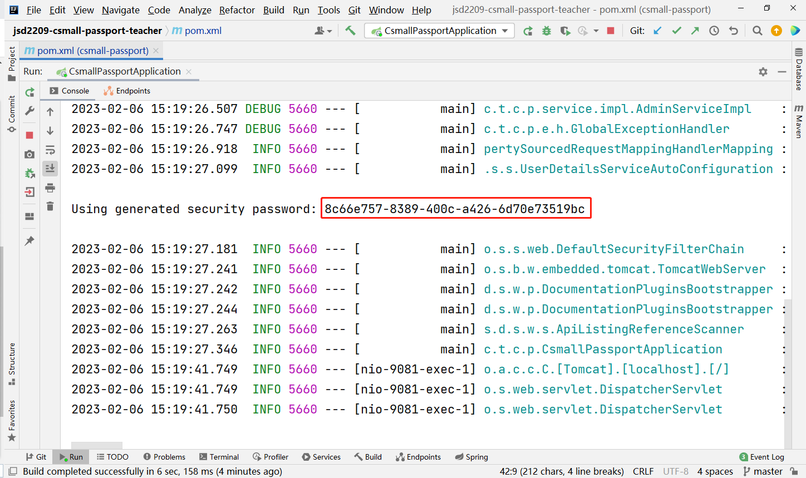

# 根据父级查询子级类别列表--Mapper层

此功能此前已完成

# 根据父级查询子级类别列表--Service层

在`ICategoryService`接口中添加抽象方法：

```java
/**
 * 根据父级类别查询其子级类别列表
 *
 * @param parentId 父级类别的id
 * @return 类别列表
 */
List<CategoryListItemVO> listByParentId(Long parentId);
```

在`CategoryServiceImpl`中实现以上方法：

```java
@Override
public List<CategoryListItemVO> listByParentId(Long parentId) {
    log.debug("开始处理【根据父级查询子级类别列表】的业务，参数：{}", parentId);
    List<CategoryListItemVO> list = categoryMapper.list();
    return list;
}
```

在`CategoryServiceTests`中编写并执行测试：

```java
@Test
void listByParentId() {
    Long parentId = 0L;
    List<?> list = service.listByParentId(parentId);
    log.debug("查询列表完成，列表中的数据的数量：{}", list.size());
    for (Object item : list) {
        log.debug("{}", item);
    }
}
```

# 根据父级查询子级类别列表--Controller层

在`CategoryController`中处理请求：

```java
// http://localhost:9080/categories/list-by-parent
@GetMapping("/list-by-parent")
@ApiOperation("根据父级查询子级类别列表")
@ApiOperationSupport(order = 420)
public JsonResult<List<CategoryListItemVO>> listByParentId(Long parentId) {
    log.debug("开始处理【根据父级查询子级类别列表】的业务，无参数");
    List<CategoryListItemVO> list = categoryService.listByParentId(parentId);
    return JsonResult.ok(list);
}
```

# 关于csmall-passport项目

项目GITEE地址：https://gitee.com/chengheng2022/jsd2209-csmall-passport-teacher.git

此项目主要用于实现“管理员”账号的后台管理功能，主要实现：

- 管理员登录
- 添加管理员
- 删除管理员
- 显示管理员列表
- 启用 / 禁用管理员

# 关于RBAC

**RBAC**：Role-Based Access Control，基于角色的访问控制

在涉及权限管理的应用软件设计中，应该至少需要设计以下3张数据表：

- 用户表
- 角色表
- 权限表

并且，还至少需要2张关联表：

- 用户与角色的关联表
- 角色与权限的关联表

# 关于Spring Security框架

Spring Security主要解决了认证与授权相关的问题。

认证：判断某个账号是否允许访问某个系统，简单来说，就是验证登录

授权：判断是否允许已经通过认证的账号访问某个资源，简单来说，就是判断是否具有权限执行某项操作

# 添加依赖

在基于Spring Boot的项目中，使用Spring Security需要添加依赖项：

```xml
<!-- Spring Boot Security依赖项，用于处理认证与授权相关的问题 -->
<dependency>
    <groupId>org.springframework.boot</groupId>
    <artifactId>spring-boot-starter-security</artifactId>
</dependency>
```

当在项目中添加以上依赖项后，你的项目会发生以下变化（Spring Boot中的Spring Security的默认行为）：

- 所有的请求都是必须要登录才允许访问的，包括错误的URL

- 提供了默认的登录页面，当未登录时，会自动重定向到此登录页面

- 提供了临时的登录账号，用户名是`user`，密码是启动项目时在控制台中的UUID值（每次重启项目都会不同）

  

- 当登录成功后，将自动重定向到此前尝试访问的URL，如果此前没有尝试访问某个URL，则重定向到根路径
- 可以通过 `/logout` 路径访问到“退出登录”的页面，以实现登出
- 当登录成功后，`POST`请求都是不允许的，而`GET`请求是允许的

# 关于Spring Security的配置类

在项目的根包下，创建`config.SecurityConfiguration`类，继承自`WebSecurityConfigurerAdapter`类，在类上添加`@Configuration`注解：

```java
@Configuration
public class SecurityConfiguration extends WebSecurityConfigurerAdapter {
}
```

然后，在类中重写`void configure(HttpSecurity http)`方法：

```java
@Configuration
public class SecurityConfiguration extends WebSecurityConfigurerAdapter {

    @Override
    protected void configure(HttpSecurity http) throws Exception {

    }

}
```

**注意：**在重写的方法中，不要使用`super`调用父类的此方法！

由于没有调用父类此方法，再次重启项目后，与此前将有些不同：

- 所有请求都不再要求登录
- 登录、登出的URL不可访问

# 关于登录表单

在Spring Security配置类的`configure(HttpSecurity http)`方法中，根据是否调用了参数对象的`formLogin()`方法，决定是否启用登录表单页（`/login`）和登出页（`/logout`），例如：

```java
@Override
protected void configure(HttpSecurity http) throws Exception {
    // 调用formLogin()表示启用登录表单页和登出页，如果未调用此方法，则没有登录表单页和登出页
    http.formLogin();
}
```

# 关于URL的访问控制

在Spring Security配置类的`configure(HttpSecurity http)`方法中，

```java
// 白名单
// 使用1个星号，表示通配此层级的任意资源，例如：/admin/*，可以匹配 /admin/delete、/admin/add-new
// 但是，不可以匹配多个层级，例如：/admin/*，不可以匹配 /admin/9527/delete
// 使用2个连续的星号，表示通配任何层级的任意资源，例如：/admin/**，可以匹配 /admin/delete、/admin/9527/delete
String[] urls = {
        "/doc.html",
        "/**/*.js",
        "/**/*.css",
        "/swagger-resources",
        "/v2/api-docs"
};

// 配置URL的访问控制
http.authorizeRequests() // 配置URL的访问控制
        .mvcMatchers(urls) // 匹配某些URL
        .permitAll() // 直接许可，即：不需要通过认证就可以直接访问
        .anyRequest() // 任何请求
        .authenticated(); // 以上配置的请求需要是通过认证的
```

# 使用临时的自定义账号实现登录

可以自定义类，实现`UserDetailsService`接口，并保证此类是组件类，则Spring Security框架会基于此实现类来处理认证。

在项目的根包下创建`security.UserDetailsServiceImpl`类，实现`UserDetailsService`接口，并在类上添加`@Service`注解，重写接口中定义的抽象方法：

```java
@Service
public class UserDetailsServiceImpl implements UserDetailsService {
    @Override
    public UserDetails loadUserByUsername(String s) 
        						throws UsernameNotFoundException {
        return null;
    }
}
```

当项目中存在`UserDetailsService`类型的组件对象时，尝试登录时，Spring Security会自动使用登录表单提交过来的用户名来调用以上`loadUserByUsername()`方法，并得到`UserDetails`类型的对象，此对象中应该包含用户的相关信息，例如密码、账号状态等，接下来，Spring Security会自动使用登录表单提交过来的密码与`UserDetails`中的密码进行对比，且判断账号状态，以决定此账号是否能够通过认证。

所以，重写以上方法：

```java
@Override
public UserDetails loadUserByUsername(String s) throws UsernameNotFoundException {
    // 假设存在可用的账号信息：用户名（root），密码（123456）
    if ("root".equals(s)) {
        UserDetails userDetails = User.builder()
                .username("root")
                .password("123456")
                .disabled(false)
                .accountLocked(false)
                .accountExpired(false)
                .credentialsExpired(false)
                .authorities("暂时给个山寨权限，暂时没有作用，只是避免报错而已")
                .build();
        return userDetails;
    }
    return null;
}
```

**提示：**当项目中存在`UserDetailsService`类型的组件对象时，Spring Security框架不再提供临时的账号（用户名为`user`密码为启动项目时的UUID值的账号）！

**注意：**Spring Security在处理认证时，要求密码必须经过加密码处理，即使你执意不加密，也必须明确的表示出来！

在`SecurityConfiguration`中，通过`@Bean`方法配置`PasswordEncoder`，并返回`NoOpPasswordEncoder`的对象，表示“不对密码进行加密处理”：

```java
@Bean
public PasswordEncoder passwordEncoder() {
    return NoOpPasswordEncoder.getInstance();
}
```

完成后，重启项目，通过`/login`可以测试访问。

# 使用数据库中的账号数据实现登录

需要实现“根据用户名查询用户的登录信息”，需要执行的SQL语句大致是：

```mysql
select id, username, password, enable from ams_admin where username=?
```

在项目的根包下创建`pojo.vo.AdminLoginInfoVO`类：

```java
@Data
public class AdminLoginInfoVO implements Serializable {
    private Long id;
    private String username;
    private String password;
    private Integer enable;
}
```

在`AdminMapper.java`接口中添加抽象方法：

```java
AdminLoginInfoVO getLoginInfoByUsername(String username);
```

在`AdminMapper.xml`中配置以上抽象方法映射的SQL：

```xml
<select ...></select>

<sql></sql>

<resultMap></resultMap>
```

在`AdminMapperTests`中编写并执行测试：

```java
```

接下来，在`UserDetailsServiceImpl`中，先自动装配`AdminMapper`对象，然后，调整`loadUserByUsername()`方法：

```java
@Override
public UserDetails loadUserByUsername(String s) throws UsernameNotFoundException {
    // 使用参数s作为参数，调用AdminMapper对象的getLoginInfoByUsername()方法执行查询
    // 判断查询结果是否为null
    // 是：无此用户名对应的账号信息，返回null
    
    // 返回UserDetails对象
    // username：来自查询结果
    // password：暂时写死为123456，后续再改成来自查询结果
    // disable：来自查询结果中的enable，判断enable是否为0
    // accountExpired等：参考此前的Demo，将各值写死
}
```

完成后，可以使用数据库中的账号测试登录（暂时不方便测试密码）。
