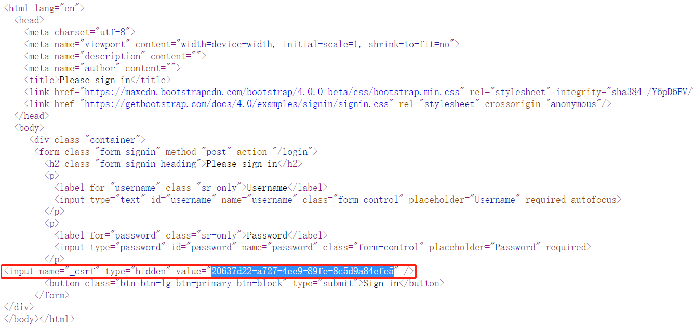

# 关于防止伪造的跨域攻击

**伪造的跨域攻击：**此类攻击主要源自“服务器端对客户端的浏览器的信任”（本质上是浏览器对同一个服务器端会携带同一个Session ID），例如，用户在浏览器的第1个选项卡中登录了，在第2个、第3个等等其它选项卡访问同样的服务器，也会被视为“已登录”的状态。所以，假设某用户在浏览器的第1个选项卡中登录了网上银行，第2个选项卡打开其它某个恶意的网站（并不是网上银行），此网站中隐藏了一个网上银行发起请求的链接，并会自动提交（比较典型的做法就是把链接做为``标签的`src`值，并隐藏此``标签使之不显示），则会导致在第2个选项卡中打开恶意网站时就向网上银行发出了请求，网上银行接收到此请求时，也会视为“已登录”的状态！虽然通过这种手段基本上无法实现财产的窃取，但仍可以做一些其它的数据窃取。

**典型的防御手段：**在“非前后端分离”的开发模式下，服务器端在生成表单时，会在表单中隐藏一个具有“唯一性”或较强的“随机性”的值，正常提交表单时，此值会随着表单数据一并提交到服务器端，所以，服务器端会根据是否正确的提交了这个值，来判断是否是通过正常方式提交的请求。以Spring Security的默认登录表单为例：



**注意：**在“前后端分离”的项目中，由于服务器端不负责生成各表单页面，所以，也无法在表单中添加UUID值，则客户端提交的请求中也无法提交正确的UUID值，所以，这种防御机制并不适用！

在Spring Security的配置类中，调用`HttpSecurity`对象的`csrf().disable()`方法可以禁用此防御机制，则POST请求不再被要求提交UUID值，是可以正常使用的！例如：

```java
@Override
protected void configure(HttpSecurity http) throws Exception {
    // 禁用“防止伪造的跨域攻击”这种防御机制
    http.csrf().disable();

    // 暂不关心其它配置的代码
}
```

# 关于BCrypt算法

BCrypt算法是目前用于处理密码加密存储时最安全的算法之一！

在Spring Security框架中，自带了`BCryptPasswordEncoder`类，用于执行加密与对比。

```java
public class BCryptTests {

    BCryptPasswordEncoder passwordEncoder = new BCryptPasswordEncoder();

    @Test
    void encode() {
        String rawPassword = "123456";
        System.out.println("原文：" + rawPassword);

        for (int i = 0; i < 10; i++) {
            String encodedPassword = passwordEncoder.encode(rawPassword);
            System.out.println("密文：" + encodedPassword);
        }
        // 原文：123456
        // 密文：$2a$10$i9E1pAtpQXIV4uUOjNr7ve/SWM9BDQl4hxq7Qz.kYDeLHTJwKhr7K
        // 密文：$2a$10$GCBOO7x7r8TjACK.ujA3oeft2uoKBTUm2L8UbWTRlnaugIupQB2Aq
        // 密文：$2a$10$osWYVZT3aBnG9h9ACiS8Mup3Hu4gjx1Lf46OIrjmseICX1cEPXZO6
        // 密文：$2a$10$r9l2Yced59FDWSFgh.mvmeAEyVQ9utfnEJJKuawO/17ndBT/xCF1q
        // 密文：$2a$10$A2DhHyIOTmWFbekRwM.wuOMSYQ1xVail7q3b1jkM4bdOjNJmfHuFK
        // 密文：$2a$10$YdvML3WsSlMghscfry/zkO67Yp8HZuVakMAXXDtuN.xmZUjVGcp5i
        // 密文：$2a$10$F.SxK1hRERQN6rwDIKw2BeD/wNXndICBs7pB9KJ7.rb9hqGVmpeeS
        // 密文：$2a$10$vtLCxMWTylqcqLwdcQpzIO00oT.lmULR9aQoelfP4BP6/0FBa2ckG
        // 密文：$2a$10$NX.BX7byguflK6G4/lQhVuJZZbekko.6h69Tilvdu2uMGHJuQCxi.
        // 密文：$2a$10$PNwmIXSRmy5yISsdbW1/Jusq4xwRx1KbkNGu.uJC2fYiHRQjOkWvS
    }

    @Test
    void matches() {
        String rawPassword = "123456";
        String encodedPassword = "$2a$10$osWYVZT3aBnG9h9ACiS8Mup3Hu4gjx1Lf46OIrjmseICX1cEPXZO6";
        boolean result = passwordEncoder.matches(rawPassword, encodedPassword);
        System.out.println("原文：" + rawPassword);
        System.out.println("密文：" + encodedPassword);
        System.out.println("匹配结果：" + result);
    }

}
```

BCrypt算法是一个运算效率极低的算法，可以非常有效的避免穷举式的暴力破解，这也是BCrypt算法的核心优势之一！

# 关于PasswordEncoder

`PasswordEncoder`是一个接口，`BCryptPasswordEncoder`、`NoOpPasswordEncoder`都是其典型的实现类。

Spring Security框架在处理认证时（判断尝试登录的账号的密码是否正确时），会自动使用`PasswordEncoder`中的`matches()`方法将原文和密文进行对比，所以：

- 你需要配置某个`PasswordEncoder`对象到Spring容器中
- 在`UserDetailsService`接口中的`loadUserByUsername()`方法，返回的`UserDetails`接口类型的对象中的`password`应该与你配置的`PasswordEncoder`使用的算法是对应的

# 使用前后端分离的登录

首先，要保证默认的登录表单不被启用，即：在Spring Security的配置类中，不再使用`http.formLogin()`方法！

然后：

- 需要使用控制器（Controller）接收来自客户端提交的用户名和密码
  - 建议自定义POJO将客户端提交的数据封装起来
- 在Service层中处理登录的认证
  - 具体的处理，仍交由Spring Security来实现，需要调用`AuthenticationManager`（认证管理器）对象的`authenticate()`方法，则Spring Security会自动调用`UserDetailsService`接口对象的`loadUserByUsername()`方法获取用户信息详情并自动验证此用户是否允许登录

所以，在项目的根包下创建`pojo.dto.AdminLoginDTO`类，用于封装客户端提交的用户名和密码：

```java
@Data
public class AdminLoginDTO implements Serializable {
    private String username;
    private String password;
}
```

然后，在Spring Security的配置类（自定义的`SecurityConfiguration`类）中重写`authenticationManagerBean()`方法，并在此方法上添加`@Bean`注解，则Spring会自动调用此方法，得到`AuthenticationManager`类型的对象，并保存在Spring容器中，后续，需要`AuthenticationManager`时可以自动装配！

```java
@Bean // 重要
@Override
public AuthenticationManager authenticationManagerBean() throws Exception {
    return super.authenticationManagerBean();
}
```

**注意：**以上重写的是`authenticationManagerBean()`方法，而不是`authenticationManager()`方法！如果重写错误，在后续某此测试中会出现死循环，导致内存溢出！

在`IAdminService`接口中添加抽象方法：

```java
void login(AdminLoginDTO adminLoginDTO);
```

在`AdminServiceImpl`中重写以上方法：

```java
@Autowired
private AuthenticationManager authenticationManager;

@Override
public void login(AdminLoginDTO adminLoginDTO) {
    log.debug("开始处理【管理员登录】的业务，参数：{}", adminLoginDTO);
    Authentication authentication = new UsernamePasswordAuthenticationToken(
            adminLoginDTO.getUsername(), adminLoginDTO.getPassword());
    authenticationManager.authenticate(authentication);
}
```

在`AdminController`中添加处理请求的方法：

```java
// http://localhost:9081/admins/login
@PostMapping("/login")
public JsonResult<Void> login(AdminLoginDTO adminLoginDTO) {
    log.debug("开始处理【管理员登录】的请求，参数：{}", adminLoginDTO);
    adminService.login(adminLoginDTO);
    return JsonResult.ok();
}
```

另外，还需要将`/admins/login`添加到Spring Security配置类中的白名单中：

```java
@Override
protected void configure(HttpSecurity http) throws Exception {
    // 白名单
    String[] urls = {
            "/doc.html",
            "/**/*.js",
            "/**/*.css",
            "/swagger-resources",
            "/v2/api-docs",
            "/admins/login" // 新增，重要
    };

    // 暂不关心其它代码
}
```

完成后，重启项目，通过API文档测试访问：

- 当用户名不存在时：

  ```
  org.springframework.security.authentication.InternalAuthenticationServiceException: UserDetailsService returned null, which is an interface contract violation
  ```

- 当密码错误时：

  ```
  org.springframework.security.authentication.BadCredentialsException: 用户名或密码错误
  ```

- 当账号被禁用时：

  ```
  org.springframework.security.authentication.DisabledException: 用户已失效
  ```

由于每种错误都会抛出某个异常，则应该先在`ServiceCode`中补充各种错误对应的业务状态码的枚举值：

```java
public enum ServiceCode {

    OK(20000),
    ERR_BAD_REQUEST(40000),
    ERR_NOT_FOUND(40400),
    ERR_UNAUTHORIZED(40100), // 新增
    ERR_UNAUTHORIZED_DISABLED(40110), // 新增
    ERR_FORBIDDEN(40300), // 新增
    ERR_CONFLICT(40900),
    ERR_INSERT(50000),
    ERR_DELETE(50100),
    ERR_UPDATE(50200),
    ERR_SELECT(50300),
    ERR_UNKNOWN(99999);
    
    // 暂不关心其它代码
    
}
```

然后在全局异常处理器中添加处理异常的方法：

```java
@ExceptionHandler({InternalAuthenticationServiceException.class,
        BadCredentialsException.class})
public JsonResult<Void> handleAuthenticationException(AuthenticationException e) {
    log.warn("程序运行过程中出现AuthenticationException，将统一处理！");
    log.warn("异常信息：{}", e.getMessage());
    String message = "登录失败，用户名或密码错误！";
    return JsonResult.fail(ServiceCode.ERR_UNAUTHORIZED, message);
}

@ExceptionHandler
public JsonResult<Void> handleDisabledException(DisabledException e) {
    log.warn("程序运行过程中出现DisabledException，将统一处理！");
    log.warn("异常信息：{}", e.getMessage());
    String message = "登录失败，此账号已经被禁用！";
    return JsonResult.fail(ServiceCode.ERR_UNAUTHORIZED_DISABLED, message);
}
```

# 关于通过认证的标准

在Spring Security中，为每个客户端都分配了一个`SecurityContext`，会根据**在`SecurityContext`中是否存在认证信息**来判断是否已通过认证，即：

- 在`SecurityContext`中存在认证信息：已通过认证
- 在`SecurityContext`中没有认证信息：未通过认证

同时，`SecurityContext`默认是基于Session的，所以，也符合Session的某些特征，例如默认的有效期。

在项目中，可以通过`SecurityContextHolder`的静态方法`getContext()`方法，得到当前客户端对应的`SecurityContext`对象！

所以，在`AdminServiceImpl`中处理认证时，当通过认证，需要获取返回结果，并且，将返回结果存入到`SecurityContext`中：

```java
@Override
public void login(AdminLoginDTO adminLoginDTO) {
    log.debug("开始处理【管理员登录】的业务，参数：{}", adminLoginDTO);
    // 执行认证
    Authentication authentication = new UsernamePasswordAuthenticationToken(
            adminLoginDTO.getUsername(), adminLoginDTO.getPassword());
    // 【调整】以下调用方法时需要获取返回值
    Authentication authenticationResult
            = authenticationManager.authenticate(authentication);
    // 【新增】将认证信息存入到SecurityContext
    SecurityContext securityContext = SecurityContextHolder.getContext();
    securityContext.setAuthentication(authenticationResult);
}
```

# 关于`authenticate()`的认证结果

当调用`AuthenticationManager`的`authenticate()`方法执行认证，且认证通过时，此方法的返回结果例如：

```
2023-02-07 15:07:27.011 DEBUG 9212 --- [nio-9081-exec-1] c.t.c.p.service.impl.AdminServiceImpl    : 认证通过，结果：

UsernamePasswordAuthenticationToken [
	Principal=org.springframework.security.core.userdetails.User [
		Username=root, 
		Password=[PROTECTED], 
		Enabled=true, 
		AccountNonExpired=true, 
		credentialsNonExpired=true, 
		AccountNonLocked=true, 
		Granted Authorities=[暂时给个山寨权限，暂时没有作用，只是避免报错而已]
	], 
	Credentials=[PROTECTED], 
	Authenticated=true, 
	Details=null, 
	Granted Authorities=[暂时给个山寨权限，暂时没有作用，只是避免报错而已]
]
```

在认证结果中的`Principal`属性的值就是`User`类型的，本质上，就是自定义的`UserDetailsServiceImplementation`中`loadUserByUsername()`方法的返回值！

# 识别当事人

在由框架调用的方法中，可以在参数列表中添加当事人类型的参数，并在此参数上添加`@AuthenticationPrincipal`注解，则框架会自动为此参数注入值，例如：

```java
@GetMapping("")
//                                            ↓↓↓↓↓↓↓↓↓↓↓↓↓↓↓↓↓↓↓↓↓↓↓↓ 注解
//                                                                     ↓↓↓↓ 当事人的数据类型
public JsonResult<List<AdminListItemVO>> list(@AuthenticationPrincipal User user) {
    log.debug("开始处理【查询管理员列表】的请求，参数：无");
    log.debug("当事人：{}", user);
    List<AdminListItemVO> list = adminService.list();
    return JsonResult.ok(list);
}
```

其实，以上当事人的数据，就是`UserDetailsServiceImpl`中的`loadUserByUsername()`返回的`UserDetails`类型结果！

**注意：**当在处理请求的方法上添加了参数后，API文档会误以为这是需要由客户端提交的请求参数，实际此参数是由Spring Security框架来注入的，所以，应该在此参数上添加`@ApiIgnore`注解，使得API文档框架忽略此参数：

```java
@GetMapping("")
//                                            ↓↓↓↓↓↓↓↓↓↓ 新增注解
public JsonResult<List<AdminListItemVO>> list(@ApiIgnore @AuthenticationPrincipal User user) {
    log.debug("开始处理【查询管理员列表】的请求，参数：无");
    log.debug("当事人：{}", user);
    List<AdminListItemVO> list = adminService.list();
    return JsonResult.ok(list);
}
```

由Spring Security提供的`User`类型实现了`UserDetails`接口，但是，`User`类型中的属性不一定足以满足编程需求，典型的问题就是：`User`类型中没有`id`属性，则后续在控制器中也无法得知登录的用户的ID。

可以自定义类，实现`UserDetails`接口，或继承自`User`类，在`UserDetailsServiceImpl`中的`loadUserByUsername()`方法中，返回自定义类的对象，则后续在控制器中可以注入此对象！

在项目的根包下创建`security.AdminDetails`类，继承自`User`类：

```java
@ToString(callSuper = true)
public class AdminDetails extends User {

    @Getter
    private Long id;

    public AdminDetails(Long id, String username, String password, boolean enabled,
                        Collection<? extends GrantedAuthority> authorities) {
        super(username, password, enabled,
                true, true, true, authorities);
        this.id = id;
    }

}
```

并且，在`UserDetailsServiceImpl`中的`loadUserByUsername()`方法中，返回`AdminDetails`的对象：

```java
@Override
public UserDetails loadUserByUsername(String s) throws UsernameNotFoundException {
    log.debug("Spring Security调用了loadUserByUsername()方法，参数：{}", s);

    AdminLoginInfoVO loginInfo = adminMapper.getLoginInfoByUsername(s);
    log.debug("从数据库查询用户名【{}】匹配的信息，结果：{}", s, loginInfo);

    if (loginInfo == null) {
        return null; // 暂时
    }
    
    // ========== 以下是调整后的代码 ==========
    List<SimpleGrantedAuthority> authorities = new ArrayList<>();
    SimpleGrantedAuthority authority = new SimpleGrantedAuthority("这是临时使用的一个山寨的权限");
    authorities.add(authority);

    AdminDetails adminDetails = new AdminDetails(loginInfo.getId(),
            loginInfo.getUsername(),
            loginInfo.getPassword(),
            loginInfo.getEnable() == 1,
            authorities);
    log.debug("即将向Spring Security返回UserDetails对象：{}", adminDetails);
    return adminDetails;
}
```

接下来，就可以在控制器中将当事人类型改为自定义的数据类型：

```java
@GetMapping("")
//                                                                     ↓↓↓↓↓↓↓↓↓↓↓↓ 自定义类型的当事人
public JsonResult<List<AdminListItemVO>> list(@AuthenticationPrincipal AdminDetails adminDetails) {
    log.debug("开始处理【查询管理员列表】的请求，参数：无");
    log.debug("当事人：{}", adminDetails); // 可以获取ID
    log.debug("当事人的ID：{}", adminDetails.getId());
    log.debug("当事人的用户名：{}", adminDetails.getUsername());
    List<AdminListItemVO> list = adminService.list();
    return JsonResult.ok(list);
}
```

# 授权访问

首先，需要调整原有的“根据用户名查询管理员的登录信息”功能，将用户名对应的管理员的权限列表查询出来，需要执行的SQL语句大致是：

```mysql
SELECT
    ams_admin.id,
    ams_admin.username,
    ams_admin.password,
    ams_admin.enable,
    ams_permission.value
FROM ams_admin
LEFT JOIN ams_admin_role ON ams_admin.id=ams_admin_role.admin_id
LEFT JOIN ams_role_permission ON ams_admin_role.role_id=ams_role_permission.role_id
LEFT JOIN ams_permission ON ams_role_permission.permission_id=ams_permission.id
WHERE ams_admin.username='root';
```

在`AdminLoginInfoVO`中，添加属性，以表示管理员信息中的“权限列表”：

```java
@Data
public class AdminLoginInfoVO implements Serializable {

    // 暂不关心原有的其它代码

    // ========== 以下是新增的属性 ==========
    /**
     * 权限列表
     */
    private List<String> permissions;

}
```

并在`AdminMapper.xml`中调整：

```xml
<!-- AdminLoginInfoVO getLoginInfoByUsername(String username); -->
<select id="getLoginInfoByUsername" resultMap="LoginInfoResultMap">
    SELECT
        <include refid="LoginInfoQueryFields"/>
    FROM
        ams_admin
    LEFT JOIN ams_admin_role ON ams_admin.id=ams_admin_role.admin_id
    LEFT JOIN ams_role_permission ON ams_admin_role.role_id=ams_role_permission.role_id
    LEFT JOIN ams_permission ON ams_role_permission.permission_id=ams_permission.id
    WHERE
        username=#{username}
</select>

<sql id="LoginInfoQueryFields">
    <if test="true">
        ams_admin.id,
        ams_admin.username,
        ams_admin.password,
        ams_admin.enable,
        ams_permission.value
    </if>
</sql>

<!-- collection标签：配置List类型的属性 -->
<!-- collection标签的ofType属性：配置List集合中的元素的数据类型，取值为元素类型的全限定名，java.lang包的可以省略包名 -->
<!-- collection标签的子级：配置如何创建出List集合中的每个元素对象 -->
<!-- constructor标签：通过构造方法创建对象 -->
<!-- constructor标签的子级arg标签：配置构造方法的参数 -->
<resultMap id="LoginInfoResultMap" 
           type="cn.tedu.csmall.passport.pojo.vo.AdminLoginInfoVO">
    <id column="id" property="id"/>
    <result column="username" property="username"/>
    <result column="password" property="password"/>
    <result column="enable" property="enable"/>
    <collection property="permissions" ofType="String">
        <constructor>
            <arg column="value"/>
        </constructor>
    </collection>
</resultMap>
```

接下来，在`UserDetailsServiceImpl`的`loadUserByUsername()`方法，返回的数据中应该包含正确的权限：

```java
@Override
public UserDetails loadUserByUsername(String s) throws UsernameNotFoundException {
    log.debug("Spring Security调用了loadUserByUsername()方法，参数：{}", s);

    AdminLoginInfoVO loginInfo = adminMapper.getLoginInfoByUsername(s);
    log.debug("从数据库查询用户名【{}】匹配的信息，结果：{}", s, loginInfo);

    if (loginInfo == null) {
        return null; // 暂时
    }

    // ========== 重要 ===========
    List<String> permissions = loginInfo.getPermissions();
    List<SimpleGrantedAuthority> authorities = new ArrayList<>();
    for (String permission : permissions) {
        SimpleGrantedAuthority authority = new SimpleGrantedAuthority(permission);
        authorities.add(authority);
    }

    AdminDetails adminDetails = new AdminDetails(loginInfo.getId(),
            loginInfo.getUsername(),
            loginInfo.getPassword(),
            loginInfo.getEnable() == 1,
            authorities);
    log.debug("即将向Spring Security返回UserDetails对象：{}", adminDetails);
    return adminDetails;
}
```

至此，当每个管理员登录时，当前程序都会把对应的权限列表存入到`SecurityContext`中的认证信息中！

接下来，可以开启“基于方法的权限检查”，并且，在需要检查权限的方法上，通过注解配置权限！

则在Spring Security的配置类上，添加注解，以开启“基于方法的权限检查”：

```java
@Configuration
@EnableGlobalMethodSecurity(prePostEnabled = true) // 新增
public class SecurityConfiguration extends WebSecurityConfigurerAdapter {
}
```

然后，在`AdminController`中：

```java
// http://localhost:9081/admins
@PreAuthorize("hasAuthority('/ams/admin/read')") // 配置权限
@GetMapping("")
public JsonResult<List<AdminListItemVO>> list(@AuthenticationPrincipal AdminDetails adminDetails) {
    // 暂不关心方法的实现
}
```

如果使用无此权限的账号提交请求，服务器端会出现错误：

```
org.springframework.security.access.AccessDeniedException: 不允许访问
```

则需要在`ServiceCode`中补充对应的业务状态码（此前应该已经事先添加了）：`ERR_FORBIDDEN(40300)`，然后，在`GlobalExceptionHandler`中补充处理以上异常的方法：

```java
@ExceptionHandler
public JsonResult<Void> handleAccessDeniedException(AccessDeniedException e) {
    log.warn("程序运行过程中出现AccessDeniedException，将统一处理！");
    log.warn("异常信息：{}", e.getMessage());
    String message = "禁止访问，您当前登录的账号无此操作权限！";
    return JsonResult.fail(ServiceCode.ERR_FORBIDDEN, message);
}
```


