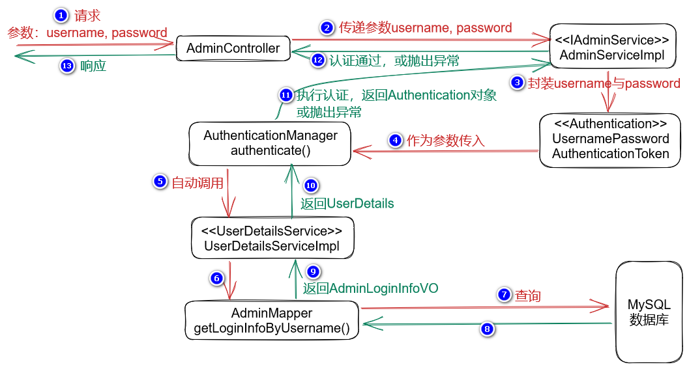

# 处理解析JWT时的异常

由于解析JWT是在过滤器中执行的，而过滤器是整个服务器端中最早接收到所有请求的组件，此时，控制器等其它组件尚未运行，则不可以使用此前的“全局异常处理器”来处理解析JWT时的异常（全局异常处理器只能处理控制器抛出的异常），也就是说，在过滤器中只能使用`try...catch`语法来处理异常！

为了便于表示需要响应到客户端的结果，仍推荐使用`JsonResult`封装相关信息，而响应到客户端的结果应该是JSON格式的，则需要将`JsonResult`对象转换成JSON格式的字符串！

在项目中添加`fastjson`依赖项，此依赖项可以实现Java对象与JSON格式的字符串的相互转换：

```xml
<!-- fastjson：实现对象与JSON的相互转换 -->
<dependency>
    <groupId>com.alibaba</groupId>
    <artifactId>fastjson</artifactId>
    <version>1.2.75</version>
</dependency>
```

在处理异常之前，还应该在`ServiceCode`中补充相关的业务状态码，例如：

```java
ERR_JWT_EXPIRED(60000),
ERR_JWT_MALFORMED(60100),
ERR_JWT_SIGNATURE(60200),
```

然后，调整`JwtAuthorizationFilter`中解析JWT的代码片段：

```java
Claims claims = null;
response.setContentType("application/json; charset=utf-8");
try {
    claims = Jwts.parser()
            .setSigningKey(secretKey)
            .parseClaimsJws(jwt)
            .getBody();
} catch (SignatureException e) {
    String message = "非法访问！";
    log.warn("解析JWT时出现SignatureException，响应消息：{}", message);
    JsonResult<Void> jsonResult 
        = JsonResult.fail(ServiceCode.ERR_JWT_SIGNATURE, message);
    PrintWriter printWriter = response.getWriter();
    printWriter.println(JSON.toJSONString(jsonResult));
    printWriter.close();
    return;
} catch (MalformedJwtException e) {
    String message = "非法访问！";
    log.warn("解析JWT时出现MalformedJwtException，响应消息：{}", message);
    JsonResult<Void> jsonResult 
        = JsonResult.fail(ServiceCode.ERR_JWT_MALFORMED, message);
    PrintWriter printWriter = response.getWriter();
    printWriter.println(JSON.toJSONString(jsonResult));
    printWriter.close();
    return;
} catch (ExpiredJwtException e) {
    String message = "您的登录信息已过期，请重新登录！";
    log.warn("解析JWT时出现ExpiredJwtException，响应消息：{}", message);
    JsonResult<Void> jsonResult 
        = JsonResult.fail(ServiceCode.ERR_JWT_EXPIRED, message);
    PrintWriter printWriter = response.getWriter();
    printWriter.println(JSON.toJSONString(jsonResult));
    printWriter.close();
    return;
}
```

# 关于认证信息中的“当事人”

认证信息中的“当事人”可以通过`@AuthenticationPrincipal`注入到方法（控制器的方法）的参数中，在访求处理过程中，可能需要获取“当事人”的ID、用户名等数据，所以，应该自定义数据类型表示“当事人”（Spring Security也希望你这样做，所以，在认证结果的信息中的“当事人”被声明为`Object`类型）！

在项目的根包下创建`security.LoginPrincipal`类：

```java
package cn.tedu.csmall.passport.security;

import lombok.Data;

import java.io.Serializable;

/**
 * 当事人类型，就是成功通过认证的用户信息类型
 * 
 * @author java@tedu.cn
 * @version 0.0.1
 */
@Data
public class LoginPrincipal implements Serializable {

    /**
     * 当事人ID
     */
    private Long id;
    /**
     * 当事人用户名
     */
    private String username;

}
```

然后，调整`JwtAuthorizationFilter`中的相关代码：

```java
Long id = claims.get("id", Long.class);
String username = claims.get("username", String.class);
log.debug("从JWT中解析得到的管理员ID：{}", id);
log.debug("从JWT中解析得到的管理员用户名：{}", username);

// 基于解析JWT的结果创建认证信息
LoginPrincipal principal = new LoginPrincipal();
principal.setId(id);
principal.setUsername(username);

// 暂不关心其它代码
```

在控制器中处理请求的方法的参数列表中，可以通过`@AuthenticationPrincipal`注入`LoginPrincipal`类型的参数，在处理请求的过程中，可以通过此参数获取当事人的具体数据：

```java
@GetMapping("")
public JsonResult<List<AdminListItemVO>> list(
    	//                                  ↓↓↓↓↓↓↓↓↓↓↓↓↓↓ 自定义的当事人类型
    	@ApiIgnore @AuthenticationPrincipal LoginPrincipal loginPrincipal) {
    log.debug("开始处理【查询管理员列表】的请求，参数：无");
    log.debug("当事人：{}", loginPrincipal);
    log.debug("当事人的ID：{}", loginPrincipal.getId());
    log.debug("当事人的用户名：{}", loginPrincipal.getUsername());
    List<AdminListItemVO> list = adminService.list();
    return JsonResult.ok(list);
}
```

# 关于权限

目前，当管理员登录成功后，服务器端生成的JWT中并不包含此管理员的权限信息，所以，此管理员后续携带JWT提交请求时，服务器端也无法根据此JWT直接获取管理员的权限列表，更加不能把正确的权限列表存入到`SecurityContext`中的认证信息中，所以，无法检查管理员的权限！

可以在管理员登录成功后，将此管理员的权限列表也写入到JWT中！

**注意：**由于权限列表并不是一般的字面值数据，生成到JWT中后，将无法还原回原本的集合类型！应该先将权限列表转换成JSON格式的字符串，后续，再根据此JSON数据还原回原本的列表！

在`AdminServiceImpl`中的`login()`方法中调整：

```java
// 将通过认证的管理员的相关信息存入到JWT中
// 准备生成JWT的相关数据
Date date = new Date(System.currentTimeMillis() + durationInMinute * 60 * 1000);
AdminDetails principal = (AdminDetails) authenticationResult.getPrincipal();
Map<String, Object> claims = new HashMap<>();
claims.put("id", principal.getId());
claims.put("username", principal.getUsername());
Collection<GrantedAuthority> authorities = principal.getAuthorities(); // 新增
String authoritiesJsonString = JSON.toJSONString(authorities); // 新增
claims.put("authoritiesJsonString", authoritiesJsonString); // 新增
```

然后，在`JwtAuthorizationFilter`中调整：

```java
Long id = claims.get("id", Long.class);
String username = claims.get("username", String.class);
String authoritiesJsonString = claims.get("authoritiesJsonString", String.class); // 新增
log.debug("从JWT中解析得到的管理员ID：{}", id);
log.debug("从JWT中解析得到的管理员用户名：{}", username);
log.debug("从JWT中解析得到的管理员权限列表JSON：{}", authoritiesJsonString);

// ========== 将原有的“山寨”权限的代码替换为以下代码 ==========
// 将JSON格式的权限列表转换成Authentication需要的类型（Collection<GrantedAuthority>）
List<SimpleGrantedAuthority> authorities =
    JSON.parseArray(authoritiesJsonString, SimpleGrantedAuthority.class);
```

最后，在控制器中，可以继续使用`@PreAuthroize`注解检查权限！

**注意：**在API文档的调试中，需要使用新的JWT数据！

# 关于清空`SecurityContext`

目前，当使用有效的JWT提交请求后，即使下一次（间隔时间不能太久）不携带JWT再次提交请求，也是服务器端认可的！

这是因为：当使用有效的JWT提交请求后，`JwtAuthorizationFilter`会将此JWT中的信息创建为`Authentication`对象，并将此`Authentication`保存到`SecurityContext`中！而`SecurityContext`是基于Session的，所以，在Session未过期之前，即使后续的请求没有携带JWT，Spring Security仍能从Session中找到`SecurityContext`中的`Authentication`对象，会视为此次访问与此前的访问是同一个客户端。

如果认为这是一种不合理的表现，可以在`JwtAuthorizationFilter`中，在执行过滤之初，就不由分说的**清空`SecurityContext`**即可！

```java
// 清除SecurityContext中的数据
SecurityContextHolder.clearContext();
```

# 处理未登录的错误

当客户端没有携带JWT，却向需要通过认证的URL发起请求，默认将响应`403`错误，这种问题需要在Spring Security的配置类中的`void configure(HttpSecurity http)`方法中进行配置：

```java
// 处理“需要通过认证，但是实际上未通过认证就发起的请求”导致的错误
http.exceptionHandling().authenticationEntryPoint(new AuthenticationEntryPoint() {
    @Override
    public void commence(HttpServletRequest request, HttpServletResponse response, AuthenticationException e) throws IOException, ServletException {
        String message = "未检测到登录，请登录！（在开发阶段，看到此提示时，请检查客户端是否携带了JWT向服务器端发起请求）";
        JsonResult<Void> jsonResult = JsonResult.fail(ServiceCode.ERR_UNAUTHORIZED, message);
        response.setContentType("application/json; charset=utf-8");
        PrintWriter printWriter = response.getWriter();
        printWriter.println(JSON.toJSONString(jsonResult));
        printWriter.close();
    }
});
```

# 关于Spring Security的认证流程



# 使用axios携带JWT发起请求

当需要携带JWT发起请求时，根据业内惯例，JWT应该放在请求头的`Authorization`属性中，则使用axios时需要自定义请求头，其语法是：

```java
// 以下调用的create()表示创建一个axios实例，此函数的参数是一个对象，用于表示新创建的axios的参数
this.axios
	.create({
        'headers': {
            'Authorization': jwt
        }
    })
    .get(); // 与此前使用相同，在此处调用get()或post()发起请求
```

# 关于复杂请求的预检机制导致的跨域问题

在使用了Spring Security框架的项目中，当客户端携带JWT向服务器端发起异步请求，默认会出现跨域访问的错误（即使在服务器端通过Spring MVC配置类允许跨域，此问题依然存在），可以在Spring Security的配置类中的`void configure(HttpSecurity http)`方法中添加配置，以解决此问题：

```java
http.cors();
```

出现此问题的根本原因在于：如果客户端提交的请求自定义了请求头中的特定属性（例如配置了请求头中的`Authorization`属性），此请求会被视为“复杂请求”，客户端的浏览器会先向服务器端的此URL发起`OPTIONS`类型的请求执行“预检（PreFlight）”，如果预检不通过，则不允许提交原本尝试提交的请求。

所以，可以在Spring Security的配置类中，对所有`OPTIONS`类型的请求“放行”，即可解决此问题：

```java
http.authorizeRequests() // 配置URL的访问控制

    	// 重要，以下2行代码表示：对所有OPTIONS类型的请求“放行”
        .mvcMatchers(HttpMethod.OPTIONS, "/**")
        .permitAll()

        .mvcMatchers(urls)
        .permitAll()
        .anyRequest()
        .authenticated();
```

或者，通过`http.cors();`也可以解决此问题，此方法的本质是启用了Spring Security自带的`CorsFilter`过滤器，此过滤器会对`OPTIONS`请求放行。


